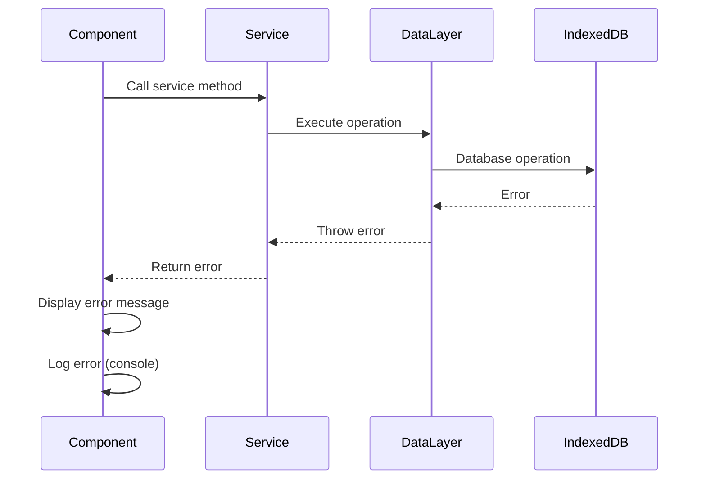

# Error Handling Strategy

## Error Flow



## Error Response Format

```typescript
interface AppError {
  code: string;
  message: string;
  details?: Record<string, any>;
  timestamp: string;
}

// Example error types
enum ErrorCode {
  TASK_NOT_FOUND = 'TASK_NOT_FOUND',
  TIMER_ALREADY_ACTIVE = 'TIMER_ALREADY_ACTIVE',
  DATABASE_ERROR = 'DATABASE_ERROR',
  VALIDATION_ERROR = 'VALIDATION_ERROR'
}
```

## Frontend Error Handling

```typescript
// Error Boundary component
class ErrorBoundary extends React.Component {
  // Catches component errors and displays fallback UI
}

// Service error handling
try {
  await timerService.startTimer(taskId);
} catch (error) {
  if (error.code === ErrorCode.TIMER_ALREADY_ACTIVE) {
    showNotification('A timer is already running');
  } else {
    showNotification('Failed to start timer. Please try again.');
    console.error(error);
  }
}
```

## Backend Error Handling

**N/A** - No backend
