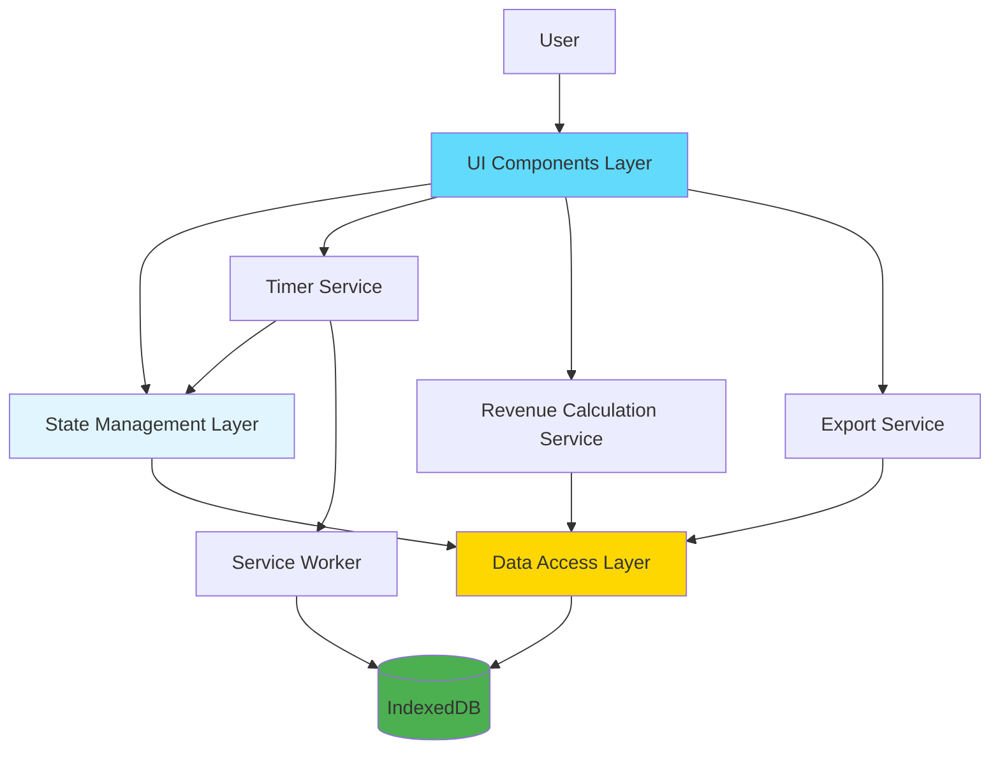

# Components

The application is organized into logical components that handle specific responsibilities. Since this is a frontend-only application, all components are React components and services that operate in the browser.

## Data Access Layer

**Responsibility:** Provides abstraction over IndexedDB operations using Dexie.js. Handles all CRUD operations for tasks, clients, projects, time entries, columns, subtasks, and settings.

**Key Interfaces:**
- `TaskRepository` - CRUD operations for tasks
- `ClientRepository` - CRUD operations for clients
- `ProjectRepository` - CRUD operations for projects
- `TimeEntryRepository` - CRUD operations for time entries
- `ColumnRepository` - CRUD operations for columns
- `SubtaskRepository` - CRUD operations for subtasks
- `SettingsRepository` - Read/write application settings
- `DatabaseService` - Database initialization, migrations, and connection management

**Dependencies:** Dexie.js, IndexedDB

**Technology Stack:** TypeScript, Dexie.js ^3.2.4

## State Management Layer

**Responsibility:** Manages application state using React Context API. Provides state to components and handles state updates reactively.

**Key Interfaces:**
- `TaskContext` - Task state and operations (create, update, delete, move)
- `TimerContext` - Active timer state and operations (start, stop, pause)
- `ClientContext` - Client state and operations
- `ProjectContext` - Project state and operations
- `ColumnContext` - Column state and operations
- `SettingsContext` - Application settings state
- `FilterContext` - Search and filter state

**Dependencies:** React Context API, Data Access Layer

**Technology Stack:** React ^18.2.0, TypeScript

## Timer Service

**Responsibility:** Manages timer functionality including active timer state, background timer operation via Service Worker, and time calculations.

**Key Interfaces:**
- `startTimer(taskId: string)` - Start timer for a task
- `stopTimer()` - Stop active timer and save time entry
- `pauseTimer()` - Pause active timer (future enhancement)
- `getElapsedTime(taskId: string)` - Get elapsed time for active timer
- `syncTimerState()` - Synchronize timer state with Service Worker

**Dependencies:** TimerContext, Data Access Layer, Service Worker

**Technology Stack:** TypeScript, Service Worker API

## Revenue Calculation Service

**Responsibility:** Calculates revenue potential based on billable hours and hourly rates, respecting the rate hierarchy (task > project > client > global).

**Key Interfaces:**
- `calculateTaskRevenue(task: Task, timeEntries: TimeEntry[])` - Calculate revenue for a single task
- `calculateClientRevenue(clientId: string, dateRange?: DateRange)` - Calculate revenue for a client
- `calculateProjectRevenue(projectId: string, dateRange?: DateRange)` - Calculate revenue for a project
- `getEffectiveHourlyRate(task: Task)` - Get effective hourly rate based on hierarchy

**Dependencies:** Data Access Layer

**Technology Stack:** TypeScript

## Export Service

**Responsibility:** Handles data export functionality (CSV and JSON formats) for time tracking data and revenue summaries.

**Key Interfaces:**
- `exportTimeEntries(format: 'csv' | 'json', filters?: ExportFilters)` - Export time entries
- `exportRevenueSummary(format: 'csv' | 'json', dateRange?: DateRange)` - Export revenue data
- `exportAllData(format: 'json')` - Export complete backup (all data)

**Dependencies:** Data Access Layer, PapaParse (for CSV)

**Technology Stack:** TypeScript, PapaParse ^5.4.1

## UI Components Layer

**Responsibility:** React components for user interface. Organized by feature area.

**Key Components:**
- `KanbanBoard` - Main kanban board container
- `Column` - Individual kanban column
- `TaskCard` - Task card display with timer controls
- `TaskDetailPanel` - Side panel for task details/editing
- `TimerControl` - Timer start/stop/pause controls
- `ClientSelector` - Client selection dropdown with inline creation
- `ProjectSelector` - Project selection dropdown with inline creation
- `RevenueDashboard` - Revenue summary views
- `SettingsPanel` - Application settings interface
- `OnboardingWizard` - First-time user onboarding flow

**Dependencies:** React, @dnd-kit/core, Tailwind CSS, State Management Layer

**Technology Stack:** React ^18.2.0, @dnd-kit/core ^6.0.0, Tailwind CSS ^3.4.0, TypeScript

## Service Worker Infrastructure

**Responsibility:** Handles offline functionality, asset caching, and background timer operation.

**Key Interfaces:**
- Asset caching strategy (Workbox)
- Background timer management
- Offline state detection
- Cache updates and versioning

**Dependencies:** Workbox, IndexedDB

**Technology Stack:** Workbox ^7.0.0, Service Worker API

## Component Diagrams

