# Core Workflows

Key system workflows illustrating how components interact to fulfill user journeys:

## Workflow 1: Start Timer on Task

## Workflow 2: Move Task Between Columns

## Workflow 3: Calculate Revenue for Task

```mermaid
sequenceDiagram
    participant TaskCard
    participant RevenueService
    participant DataLayer
    participant IndexedDB

    TaskCard->>RevenueService: Calculate revenue for task
    RevenueService->>DataLayer: Get task
    DataLayer->>IndexedDB: Query task
    RevenueService->>DataLayer: Get time entries for task
    DataLayer->>IndexedDB: Query time entries
    RevenueService->>RevenueService: Get effective hourly rate
    RevenueService->>RevenueService: Calculate: billableHours × rate
    RevenueService->>TaskCard: Return revenue amount
    TaskCard->>TaskCard: Display revenue on card
```

## Workflow 4: Background Timer Operation

