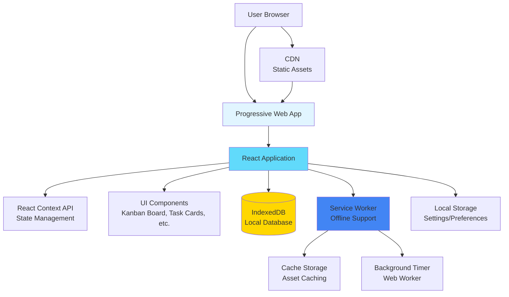

# High Level Architecture

## Technical Summary

The Time-Tracking Kanban App is a local-first Progressive Web Application (PWA) built with React and TypeScript, optimized for desktop browser use. The application follows a component-based architecture where all data processing, storage, and business logic execute entirely in the browser using IndexedDB for persistent local storage. The architecture emphasizes offline-first operation through Service Worker infrastructure, ensuring the application functions without internet connectivity after initial load. React Context API manages application state, eliminating the need for external state management libraries. The application is built with Vite for fast development iteration and optimized production builds, deployed as static assets to a CDN. This architecture achieves the PRD goals of privacy-first data storage, offline functionality, and desktop-optimized performance while maintaining simplicity and avoiding backend infrastructure complexity.

## Platform and Infrastructure Choice

**Platform:** Vercel

**Rationale:**

Since this is a frontend-only application with no backend services, the platform choice focuses on static asset hosting and CDN distribution. Vercel was selected for its excellent React integration, automatic HTTPS, global CDN, easy Git-based deployment workflow, and preview deployments. The platform's automatic optimizations and developer experience align well with the development workflow.

**Key Services:**
- Static Asset Hosting (HTML, CSS, JavaScript bundles)
- Global CDN for fast asset delivery
- Automatic HTTPS
- Git-based deployment pipeline

**Deployment Host and Regions:** Global CDN (edge locations worldwide for optimal performance)

## Repository Structure

**Structure:** Simple Single Package

**Rationale:** For MVP, a simple single-package structure is sufficient and keeps the project straightforward. The structure separates concerns clearly while maintaining simplicity.

**Package Organization:**
```
time-tracking-kanban/
├── src/                    # Application source code
├── public/                 # Static assets
├── docs/                   # Documentation
├── tests/                  # Test files
└── package.json           # Root package configuration
```

If the project grows to include shared packages or utilities in the future, we can migrate to npm workspaces or a tool like Turborepo.

## High Level Architecture Diagram



## Architectural Patterns

- **Local-First Architecture:** All data stored and processed locally in the browser - _Rationale:_ Ensures privacy, offline functionality, and eliminates backend infrastructure costs while meeting PRD requirements for local data storage.

- **Component-Based UI:** React components with TypeScript for type safety - _Rationale:_ Enables reusable, maintainable UI components that can efficiently render 1000+ tasks through React's virtual DOM and optimization techniques like React.memo.

- **Progressive Web App (PWA):** Service Worker-based offline functionality - _Rationale:_ Provides native app-like experience, offline operation, and installability without requiring app store distribution, meeting PRD requirements for cross-platform desktop support.

- **Context-Based State Management:** React Context API for application state - _Rationale:_ Sufficient for local-only application without external state synchronization needs, avoiding complexity of Redux or similar libraries while maintaining reactive updates.

- **Repository Pattern (Data Layer):** Abstracted data access layer over IndexedDB - _Rationale:_ Enables testability with mock implementations, provides clean separation between business logic and storage, and allows future migration to alternative storage solutions if needed.

- **Service Worker Pattern:** Background processing for timers and asset caching - _Rationale:_ Enables timer functionality when browser tab is inactive and provides offline asset caching, meeting PRD requirements for background timer operation and offline-first architecture.

### Service Worker Background Timer Implementation Details

The Service Worker handles background timer operation to ensure accurate time tracking even when the browser tab is inactive or minimized. The implementation uses a combination of Service Worker and Web Worker patterns:

**Architecture:**
1. **Main Thread Timer:** When the browser tab is active, the React application manages timer state directly using `setInterval` or `requestAnimationFrame` for precise updates.

2. **Service Worker Timer:** When the tab becomes inactive, the Service Worker takes over timer management:
   - Service Worker receives timer start/stop messages via `postMessage` API
   - Uses `setInterval` within Service Worker context (not subject to tab throttling)
   - Stores timer state in IndexedDB for persistence
   - Calculates elapsed time based on stored start timestamp

3. **State Synchronization:**
   - Timer state stored in IndexedDB with task ID, start timestamp, and status
   - When tab becomes active again, React app reads timer state from IndexedDB
   - Calculates elapsed time: `currentTime - startTimestamp`
   - Updates UI with accurate elapsed time

4. **Background Timer Accuracy:**
   - Service Worker `setInterval` runs at 1-second intervals (or longer for efficiency)
   - Periodic updates to IndexedDB store current elapsed time
   - On tab reactivation, calculates precise elapsed time from stored start timestamp
   - Handles browser throttling gracefully (Service Workers have higher priority)

5. **Browser Tab Title/Badge Updates:**
   - Service Worker can update browser tab title with active timer indicator
   - Uses `clients.matchAll()` to notify all open tabs of timer status
   - Provides visual feedback that timer is running even when tab is inactive

**Implementation Considerations:**
- **Browser Limitations:** Some browsers throttle Service Worker execution when system is idle. Timer accuracy may degrade slightly during extended inactivity, but start/stop timestamps ensure accurate total time calculation.
- **Error Handling:** If Service Worker fails or is terminated, timer state persists in IndexedDB and can be recovered on next app load.
- **Performance:** Service Worker timer updates IndexedDB periodically (every 30-60 seconds) rather than every second to reduce write operations and improve performance.
- **Cross-Tab Synchronization:** Multiple tabs can share timer state through IndexedDB and Service Worker messaging, ensuring only one timer runs at a time across all tabs.
