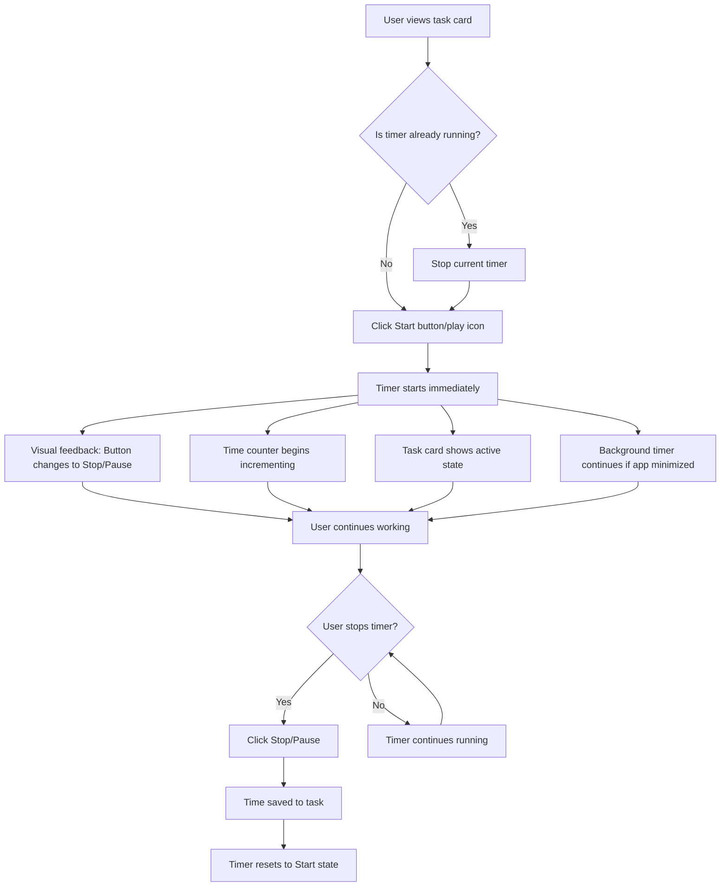
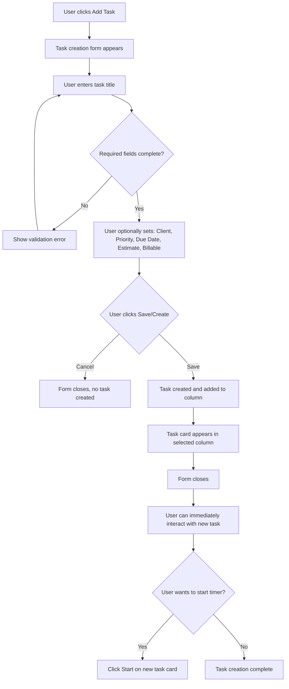
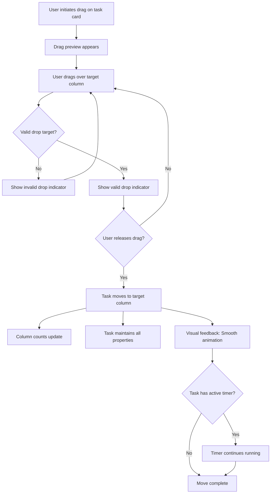
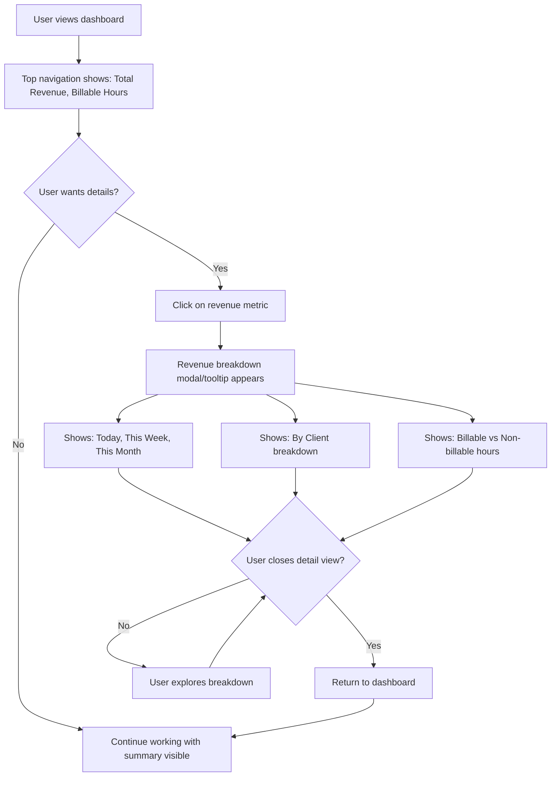

# FreelanceFlow UI/UX Specification

## Introduction

This document defines the user experience goals, information architecture, user flows, and visual design specifications for FreelanceFlow's user interface. It serves as the foundation for visual design and frontend development, ensuring a cohesive and user-centered experience.

### Overall UX Goals & Principles

#### Target User Personas

**Primary Persona: Solo Freelancer**
- **Demographics:** Independent professional managing multiple clients and projects simultaneously
- **Work Pattern:** Desktop-first workflow, extended work sessions
- **Technical Comfort:** Comfortable with productivity tools, values efficiency over complexity
- **Pain Points:** Context switching between task management and time tracking, lost billable hours, lack of freelancer-specific features in generic tools
- **Goals:** Increase revenue through accurate time tracking, reduce administrative overhead, maintain focus on billable work
- **Key Behaviors:** 
  - Frequently switches between tasks and clients throughout the day
  - Needs quick visual understanding of task status, billable hours, and revenue potential
  - Prefers keyboard shortcuts and one-click actions for common operations
  - Values clear visual hierarchy and minimal cognitive load

**Secondary Persona: Budget-Conscious Freelancer**
- **Characteristics:** Currently uses free tiers of generic tools (Asana, Trello)
- **Constraint:** Cannot afford paid customization tiers
- **Need:** Freelancer-specific features without premium pricing
- **Expectation:** Professional tool that understands their workflow

#### Usability Goals

1. **Ease of Learning:** New users can complete core tasks (create task, start timer, move task) within 5 minutes without training
2. **Efficiency of Use:** Power users can start tracking time, move tasks, and toggle billable status with single actions—no multi-step workflows for common operations
3. **Error Prevention:** Clear visual indicators for active timers, confirmation for destructive actions (delete task, stop timer), validation for time entries
4. **Memorability:** Infrequent users can return to the application and immediately understand task status, active timers, and revenue metrics through consistent visual language
5. **Satisfaction:** Users feel in control of their workflow with immediate feedback on all actions, clear revenue visibility, and reduced friction compared to using separate tools

#### Design Principles

1. **Clarity Over Cleverness** - Prioritize clear communication and immediate understanding over aesthetic innovation. Every visual element should communicate purpose instantly.

2. **One-Tap Actions** - Critical actions (start timer, move task, toggle billable) must be accessible with single clicks directly on task cards. Eliminate multi-step workflows for common operations.

3. **Visual Hierarchy Through Context** - Use color coding, typography, and spacing to help users instantly understand task status, client assignment, priority, and billable status without reading text.

4. **Immediate Feedback** - Every action (timer start/stop, task movement, status change) must have clear, immediate visual response. Users should never wonder if their action registered.

5. **Revenue Visibility** - Make billable hours and revenue potential immediately visible at both task and dashboard levels. Users should understand their earning potential at a glance.

6. **Desktop-First Optimization** - Design for extended desktop work sessions with proper spacing, readable typography, and efficient use of screen real estate. Support keyboard shortcuts for power users.

7. **Progressive Disclosure** - Show essential information (title, client, timer, time spent, billable indicator) on task cards. Detailed information (description, subtasks, full time log) available on-demand without cluttering the primary view.

8. **Consistent Visual Language** - Use consistent patterns for status indicators, color coding, and interactions throughout the application. Once learned, patterns should be predictable across all screens.

### Change Log

| Date | Version | Description | Author |
|------|---------|-------------|--------|
| TBD | v1.0 | Initial UI/UX specification creation | UX Expert |

## Information Architecture (IA)

### Site Map / Screen Inventory

```mermaid
graph TD
    A[FreelanceFlow App] --> B[Dashboard/Kanban Board]
    A --> C[Task Detail View]
    A --> D[Client Management]
    A --> E[Settings]
    A --> F[Revenue Dashboard]
    
    B --> B1[Backlog Column]
    B --> B2[In Progress Column]
    B --> B3[Review Column]
    B --> B4[Done Column - Future]
    
    C --> C1[Task Edit Form]
    C --> C2[Time Log View]
    C --> C3[Subtask Management]
    
    D --> D1[Client List]
    D --> D2[Client Detail/Edit]
    D --> D3[Add New Client]
    
    E --> E1[General Settings]
    E --> E2[Board Configuration]
    E --> E3[Keyboard Shortcuts]
    E --> E4[Theme/Dark Mode]
    E --> E5[Data Export/Backup]
    
    F --> F1[Daily Revenue View]
    F --> F2[Weekly Revenue View]
    F --> F3[Monthly Revenue View]
    F --> F4[Time Analytics]
```



**Key Screens:**
- **Dashboard/Kanban Board** - Primary interface showing all tasks organized by workflow stage
- **Task Detail View** - Expanded view for editing task details, viewing time logs, managing subtasks
- **Client Management** - Create, edit, and manage client information and default rates
- **Settings** - Application configuration, board customization, preferences
- **Revenue Dashboard** - Analytics and reporting views for billable hours and revenue

### Navigation Structure

**Primary Navigation:**
The application uses a top navigation bar that remains persistent across all screens. Based on the screenshot, the primary navigation includes:

- **Left Side:** Application branding/logo (clock icon + "FreelanceFlow" text) - serves as home/dashboard link
- **Center:** Key metrics display (Total Revenue, Billable Hours) - provides immediate context without navigation
- **Right Side:** Primary action button ("+ Add task") and utility icons (language/region, dark mode toggle)

**Secondary Navigation:**
Within the Kanban board interface, secondary navigation is contextual:

- **Column Headers:** Each column (Backlog, In Progress, Review) serves as a filter/view mechanism
- **Column Actions:** Each column header includes "+" (add task to column) and "..." (column options menu) icons
- **Task Card Actions:** Individual task cards contain contextual actions (Start timer, task menu)

**Breadcrumb Strategy:**
Given the desktop-first, single-board focus of the application, breadcrumbs are minimal. The primary navigation pattern is:

- **Dashboard Level:** No breadcrumb needed - user is always "at home"
- **Detail Views:** Simple breadcrumb showing "Dashboard > Task: [Task Name]" or "Dashboard > Client: [Client Name]"
- **Settings/Revenue Views:** "Dashboard > Settings" or "Dashboard > Revenue Dashboard"

**Navigation Principles:**
1. **Kanban-First:** The board is always accessible and serves as the primary navigation hub
2. **Contextual Actions:** Most actions happen directly on the board without leaving the main view
3. **Minimal Hierarchy:** Flat structure reduces navigation depth - users rarely go more than one level deep
4. **Quick Return:** Logo/branding always returns to dashboard, providing clear "home" anchor

## User Flows

### Flow: Start Time Tracking on Task

**User Goal:** Begin tracking time for a specific task to capture billable hours accurately.

**Entry Points:**
- Click "Start" button on task card in any column
- Click play icon on task card
- Keyboard shortcut (TBD) while task card is focused

**Success Criteria:**
- Timer starts immediately with visual feedback
- Task card shows active timer indicator
- Time begins accumulating and displaying on card
- Only one timer can be active at a time (if another timer is running, it stops automatically)
- Top navigation shows active timer status (optional)

**Flow Diagram:**



**Edge Cases & Error Handling:**
- **Another timer is active:** Automatically stop the previous timer before starting the new one. Show brief notification: "Stopped timer on [Previous Task], started timer on [Current Task]"
- **Task deleted while timer running:** Stop timer automatically, save accumulated time, show notification
- **App closed/crashed while timer running:** On app restart, detect orphaned timer session and prompt user: "Timer was running on [Task] for [X] hours. Add this time?"
- **System time changes:** Use relative time tracking to prevent negative durations or time jumps
- **Multiple tasks selected:** Disable timer start if multiple tasks are selected (selection mode)
- **Task moved to Done column:** Optionally auto-stop timer with confirmation prompt

**Notes:** 
- Timer must persist across app restarts (background timer continues)
- Visual indicator should be prominent but not distracting
- Consider showing elapsed time in top navigation bar for always-visible feedback
- Timer precision: Track to the second, display rounded to nearest minute for readability

---

### Flow: Create New Task

**User Goal:** Quickly add a new task to the kanban board with essential information.

**Entry Points:**
- Click "+ Add task" button in top navigation
- Click "+" icon in column header
- Keyboard shortcut (Cmd/Ctrl + N or TBD)

**Success Criteria:**
- Task creation form appears quickly (modal or inline)
- Task is added to appropriate column
- User can immediately start timer or edit task details
- Form validates required fields (at minimum: task title)

**Flow Diagram:**



**Edge Cases & Error Handling:**
- **Empty task title:** Show inline validation error, prevent save until title entered
- **Duplicate task titles:** Allow duplicates but show warning: "Task with this name already exists"
- **Client not selected for billable task:** Show warning but allow creation (client can be added later)
- **Invalid time estimate format:** Validate format (e.g., "2h 30m" or "2.5h"), show format hint
- **Due date in past:** Allow but show warning: "Due date is in the past"
- **Form closed accidentally:** Auto-save draft to local storage, restore on next open
- **No columns exist:** Create default columns (Backlog, In Progress, Review, Done) automatically
- **Column deleted while form open:** Default to first available column or Backlog

**Notes:**
- Quick-add mode: Allow creating task with just title, add details later via task detail view
- Smart defaults: Pre-select current column, use last-used client if available
- Keyboard navigation: Tab through fields, Enter to save, Escape to cancel
- Inline editing option: Consider allowing direct typing in column (like Trello) for fastest creation

---

### Flow: Move Task Between Columns

**User Goal:** Update task status by moving it to a different workflow stage (e.g., Backlog → In Progress → Review).

**Entry Points:**
- Drag task card to target column
- Click task card menu → "Move to [Column]"
- Keyboard shortcut (arrow keys) while task card focused

**Success Criteria:**
- Task moves smoothly with visual feedback
- Task appears in target column immediately
- Original column updates task count
- Task state persists (timer, time spent, etc.)

**Flow Diagram:**



**Edge Cases & Error Handling:**
- **Drag cancelled (ESC key):** Return task to original position, no state change
- **Drag outside valid drop zone:** Show "Cannot drop here" indicator, return to original position on release
- **Column deleted during drag:** Cancel drag operation, show error: "Target column no longer exists"
- **Task deleted during drag:** Cancel drag operation gracefully
- **Multiple tasks selected:** Move all selected tasks together, show count in feedback
- **Keyboard navigation:** Arrow keys move task to adjacent column, show preview before confirming
- **Touch devices:** Support touch drag-and-drop for tablet users (desktop-first but responsive)

**Notes:**
- Animation duration: 200-300ms for smooth but quick feedback
- Visual feedback: Show drop zone highlight, ghost preview of task in target location
- Undo support: Consider "Undo move" toast notification for accidental moves
- Auto-actions: Optionally auto-stop timer when moving to "Done" column (with user preference setting)

---

### Flow: View Revenue Summary

**User Goal:** Understand current billable hours and revenue potential at a glance.

**Entry Points:**
- View top navigation metrics (always visible)
- Click on revenue metric in top navigation
- Navigate to Revenue Dashboard (future feature)

**Success Criteria:**
- Revenue information is immediately visible without navigation
- Metrics update in real-time as timers run and tasks are completed
- Breakdown available on demand (daily/weekly/monthly)

**Flow Diagram:**



**Edge Cases & Error Handling:**
- **No billable tasks:** Show "$0.00" with helpful message: "Mark tasks as billable to track revenue"
- **Tasks without hourly rates:** Show warning: "Some tasks missing hourly rates" with link to set rates
- **Negative time (manual adjustment):** Handle gracefully, show in breakdown with explanation
- **Currency formatting:** Support different currencies, decimal precision based on user settings
- **Large numbers:** Format appropriately (e.g., "$1.2K" for $1,200)

**Notes:**
- Top navigation metrics should be non-intrusive but always visible
- Consider color coding: Green for positive revenue, neutral for zero
- Real-time updates: Refresh metrics every minute or on task/timer changes
- Future: Full Revenue Dashboard with charts, trends, export capabilities

---

### Flow: Toggle Billable Status

**User Goal:** Mark a task as billable or non-billable to control revenue tracking.

**Entry Points:**
- Click billable indicator on task card
- Task detail view → Toggle billable checkbox
- Task menu → "Mark as billable/non-billable"

**Success Criteria:**
- Billable status toggles immediately
- Visual indicator updates on task card
- Revenue calculation updates in real-time
- Status persists across app sessions

**Flow Diagram:**

```mermaid
graph TD
    A[User views task card] --> B{Task currently billable?}
    B -->|Yes| C[Shows: Green $ indicator with amount]
    B -->|No| D[Shows: "Non-billable" badge or no indicator]
    C --> E{User clicks billable indicator}
    D --> E
    E --> F[Toggle billable status]
    F --> G{Now billable?}
    G -->|Yes| H[Show billable indicator with calculated revenue]
    G -->|No| I[Remove billable indicator, show "Non-billable"]
    H --> J[Update top navigation revenue total]
    I --> J
    J --> K{Task has hourly rate?}
    K -->|No| L[Show prompt: "Set hourly rate to calculate revenue"]
    K -->|Yes| M[Calculate and display revenue]
    L --> N[User can set rate or dismiss]
    M --> O[Status saved]
    N --> O
```

**Edge Cases & Error Handling:**
- **Task without hourly rate marked billable:** Show warning but allow, prompt to set rate
- **Client has default rate but task doesn't:** Use client rate automatically, show tooltip
- **Multiple tasks selected:** Toggle all selected tasks' billable status together
- **Task moved to non-billable:** Recalculate revenue totals, show impact in notification

**Notes:**
- Visual distinction: Billable tasks should be clearly distinguishable (green $ indicator in screenshot)
- Revenue calculation: Billable hours × hourly rate (task rate > client rate > default rate priority)
- Batch operations: Support selecting multiple tasks and toggling billable status for all
- Default behavior: New tasks inherit billable status from client/project settings if available

## Wireframes & Mockups

### Primary Design Files

**Design Tool:** TBD (Figma recommended for collaboration and developer handoff)

**Design File Structure:**
- `freelanceflow-design.fig` - Main design file
- Frames organized by screen/feature
- Component library for reusable UI elements
- Design tokens for colors, typography, spacing

**Design Handoff Process:**
- Export assets and specifications from design tool
- Provide CSS/styling values for developers
- Include interaction states and animations
- Document responsive breakpoints and variations

### Key Screen Layouts

#### Dashboard/Kanban Board

**Purpose:** Primary interface for task management and time tracking. Serves as the command center where users spend most of their time.

**Key Elements:**

1. **Top Navigation Bar**
   - **Left:** Application logo (clock icon) + "FreelanceFlow" branding - clickable to return to dashboard
   - **Center:** Key metrics display
     - "Total Revenue:" with green dollar icon, value "$412.50" highlighted in green
     - "Billable Hours:" with line graph icon, value "4.0h" in darker font
   - **Right:** Primary actions and utilities
     - "+ Add task" button (black background, white text, prominent)
     - Globe/world icon (language/region settings)
     - Moon icon (dark mode toggle)

2. **Kanban Board Area**
   - **Column Structure:** Three vertical columns representing workflow stages
     - Column 1: "Backlog" (2 tasks)
     - Column 2: "In Progress" (2 tasks)
     - Column 3: "Review" (1 task)
   - **Column Headers:** Each includes
     - Column title and task count
     - "+" icon (add task to this column)
     - "..." icon (column options menu)
   - **Visual Design:**
     - Rounded corners on columns and cards
     - Subtle shadow effects for depth
     - Adequate spacing between columns for drag-and-drop
     - Scrollable columns if content exceeds viewport height

3. **Task Cards** (consistent design across all columns)
   - **Task Title:** Prominent, readable font
   - **Tags/Pills:** Color-coded indicators
     - Client tags: Light green (Acme Corp), Light purple (TechStart)
     - Priority tags: Red (high), Orange (medium), Light grey (low)
   - **Time Tracking Section:**
     - Play/Start button (black triangular icon) with "Start" label
     - Time spent display (e.g., "2h 30m", "1h 0m", "30m")
     - Clock icon with estimated time (e.g., "8h 0m", "4h 0m", "1h 0m")
   - **Revenue Indicator:** 
     - Green dollar sign with amount (e.g., "$275", "$95", "$43")
     - Light green pill-shaped background
     - "$0" shown for tasks without billable time
   - **Additional Metadata:**
     - Calendar icon with date (e.g., "Jan 24", "Jan 27", "Tomorrow")
     - "Non-billable" badge (light grey pill) when applicable
   - **Card States:**
     - Default: White background, subtle border
     - Hover: Slight elevation/shadow increase
     - Active/Dragging: Elevated shadow, slight scale
     - Timer Active: Visual indicator (e.g., pulsing border, accent color)

**Interaction Notes:**
- **Drag-and-Drop:** Smooth animation when moving cards between columns
- **Timer Control:** Click play icon to start/stop timer directly on card
- **Quick Actions:** Hover reveals additional actions (edit, delete, menu)
- **Card Expansion:** Click card to open detail view (modal or side panel)
- **Keyboard Navigation:** Arrow keys to move between cards, Enter to open details

**Design File Reference:** `Dashboard-Kanban-Board` frame in design tool

**Layout Specifications:**
- **Top Navigation Height:** ~60-70px
- **Column Width:** Flexible, minimum 280px, maximum 400px
- **Card Spacing:** 12-16px vertical spacing between cards
- **Column Spacing:** 24-32px horizontal spacing between columns
- **Padding:** 16-24px padding within columns and cards

---

#### Task Detail View (Modal/Overlay)

**Purpose:** Expanded view for editing task details, viewing full time logs, and managing subtasks without leaving the board context.

**Key Elements:**

1. **Modal Header**
   - Task title (editable)
   - Close button (X icon)
   - Save/Cancel actions

2. **Task Information Section**
   - Client/Project selector (dropdown)
   - Priority selector (high/medium/low)
   - Due date picker
   - Billable toggle switch
   - Hourly rate input (if billable)

3. **Time Tracking Section**
   - Current timer display (if active)
   - Time spent summary
   - Estimated time input
   - Time log entries (chronological list)
   - Manual time entry form

4. **Description & Notes**
   - Rich text editor for task description
   - Notes/comment section

5. **Subtasks Section**
   - List of subtasks with checkboxes
   - Add subtask functionality

**Interaction Notes:**
- Opens as modal overlay, dimming background board
- Click outside modal or ESC key to close
- Auto-save draft changes
- Real-time validation feedback

**Design File Reference:** `Task-Detail-Modal` frame

---

#### Task Creation Form

**Purpose:** Quick task creation interface accessible from multiple entry points.

**Key Elements:**

1. **Form Fields** (progressive disclosure)
   - **Required:** Task title (prominent, auto-focus)
   - **Quick Options:** Client selector, Priority, Column selection
   - **Advanced Options:** Due date, Time estimate, Billable toggle, Description

2. **Smart Defaults**
   - Pre-select current column or "Backlog"
   - Use last-used client if available
   - Default to billable if client has rate set

3. **Actions**
   - "Create Task" primary button
   - "Cancel" secondary button
   - Keyboard shortcuts (Enter to save, ESC to cancel)

**Interaction Notes:**
- Inline form option: Quick-add by typing directly in column (Trello-style)
- Modal form option: Full form with all options
- Form validation with inline error messages
- Success feedback: Task appears in column with brief highlight animation

**Design File Reference:** `Task-Creation-Form` frame

---

#### Revenue Dashboard (Future Feature)

**Purpose:** Detailed analytics and reporting for billable hours and revenue tracking.

**Key Elements:**

1. **Summary Cards**
   - Total Revenue (period selector: Today/Week/Month)
   - Billable Hours
   - Average Hourly Rate
   - Tasks Completed

2. **Charts & Visualizations**
   - Revenue trend over time (line chart)
   - Revenue by client (bar chart or pie chart)
   - Time distribution (donut chart)
   - Billable vs Non-billable hours comparison

3. **Detailed Tables**
   - Time entries by task
   - Revenue by client
   - Export options (CSV, JSON)

**Interaction Notes:**
- Period selector (Today, This Week, This Month, Custom Range)
- Interactive charts with hover tooltips
- Export functionality for reports
- Filter by client, project, date range

**Design File Reference:** `Revenue-Dashboard` frame (future)

---

#### Client Management Screen

**Purpose:** Create, edit, and manage client information and default rates.

**Key Elements:**

1. **Client List**
   - Search/filter clients
   - Client cards showing: Name, Default Rate, Total Revenue, Active Tasks

2. **Client Detail/Edit Form**
   - Client name
   - Default hourly rate
   - Contact information (optional)
   - Notes

3. **Client Actions**
   - Add new client
   - Edit existing client
   - Delete client (with confirmation)
   - View client's tasks

**Interaction Notes:**
- Quick-add client from task creation form
- Inline editing option for quick updates
- Validation: Require name, validate rate format

**Design File Reference:** `Client-Management` frame

---

#### Settings Screen

**Purpose:** Application configuration and preferences.

**Key Elements:**

1. **General Settings**
   - Theme selection (Light/Dark/System)
   - Language/Region
   - Date/Time format

2. **Board Configuration**
   - Default columns setup
   - Column customization
   - Board preferences

3. **Keyboard Shortcuts**
   - List of available shortcuts
   - Customization options

4. **Data Management**
   - Export data (CSV, JSON)
   - Backup/Restore
   - Clear data (with warning)

**Interaction Notes:**
- Settings persist immediately
- Confirmation dialogs for destructive actions
- Help tooltips for each setting

**Design File Reference:** `Settings` frame

## Component Library / Design System

### Design System Approach

**Strategy:** Build a custom design system optimized for FreelanceFlow's specific needs, drawing inspiration from established patterns (Material Design, Tailwind UI) but tailored for desktop-first kanban workflows.

**Rationale:** 
- Custom system allows precise control over freelancer-specific components (task cards, timers, revenue indicators)
- Desktop-first optimization requires different spacing, sizing, and interaction patterns than mobile-first systems
- Local-first architecture means we can optimize for performance without external design system dependencies

**Design Tokens Structure:**
- Colors (semantic naming: primary, success, warning, error, neutral)
- Typography (font families, sizes, weights, line heights)
- Spacing (consistent scale: 4px base unit)
- Shadows (elevation system)
- Border radius (consistent rounding)
- Animation durations and easing functions

**Component Categories:**
1. **Foundation:** Colors, typography, spacing, shadows
2. **Layout:** Container, grid, column, card
3. **Navigation:** Top bar, breadcrumbs, menu
4. **Forms:** Input, select, checkbox, toggle, button
5. **Data Display:** Task card, tag/pill, metric display, time display
6. **Feedback:** Toast notifications, loading states, empty states
7. **Overlay:** Modal, dropdown, tooltip

### Core Components

#### Task Card

**Purpose:** Primary data display component showing task information, time tracking, and quick actions in a compact, scannable format.

**Variants:**
- **Default:** Standard task card with all information visible
- **Compact:** Reduced padding/spacing for dense views
- **Expanded:** Shows additional details (description preview, subtasks count)
- **Active Timer:** Visual distinction when timer is running (accent border, pulsing indicator)

**States:**
- **Default:** White background, subtle border, standard elevation
- **Hover:** Increased shadow, slight scale (1.02x), cursor pointer
- **Selected:** Accent border, background tint
- **Dragging:** Elevated shadow, reduced opacity (0.8), cursor grabbing
- **Timer Active:** Accent color border (green/blue), pulsing animation
- **Disabled:** Reduced opacity (0.5), no interactions

**Usage Guidelines:**
- Use consistent card height for visual rhythm (minimum height: ~120px)
- Maintain consistent spacing between cards (12-16px)
- Ensure all interactive elements have adequate touch targets (minimum 44x44px)
- Support keyboard navigation (focusable, arrow key movement)
- Provide clear visual feedback for all state changes

**Key Elements:**
- Task title (truncate with ellipsis if too long)
- Client/project tag (color-coded pill)
- Priority tag (color-coded pill: red=high, orange=medium, grey=low)
- Timer control (play/pause button with time display)
- Revenue indicator (green $ pill with amount)
- Due date (calendar icon + date)
- Billable indicator (green $ or "Non-billable" badge)

---

#### Tag/Pill Component

**Purpose:** Compact, color-coded labels for categorizing tasks (client, priority, status).

**Variants:**
- **Client Tag:** Light background with colored text (e.g., light green for Acme Corp, light purple for TechStart)
- **Priority Tag:** Color-coded by priority level
  - High: Red background, white text
  - Medium: Orange background, white text
  - Low: Light grey background, dark text
- **Status Tag:** Indicates task status (e.g., "Non-billable" grey pill)
- **Revenue Tag:** Green background with dollar amount

**States:**
- **Default:** Standard appearance
- **Hover:** Slight scale (1.05x), show tooltip if truncated
- **Clickable:** Cursor pointer, show active state
- **Selected:** Accent border or background tint

**Usage Guidelines:**
- Use consistent height (24-28px) for visual alignment
- Limit text length (truncate with ellipsis if needed)
- Maintain sufficient color contrast (WCAG AA minimum)
- Use semantic colors (red=danger/high priority, green=success/revenue, grey=neutral)
- Group related tags together (client + priority)

**Color Specifications:**
- **Client Tags:** Light backgrounds (lightness 90-95%), colored text (saturation 60-80%)
- **Priority High:** Red (#EF4444 or similar), white text
- **Priority Medium:** Orange (#F97316 or similar), white text
- **Priority Low:** Grey (#9CA3AF or similar), dark text
- **Revenue:** Green (#10B981 or similar), white text

---

#### Timer Control

**Purpose:** Interactive component for starting, stopping, and displaying time tracking on task cards.

**Variants:**
- **Start State:** Play icon (triangle) + "Start" label + time display
- **Running State:** Pause/stop icon + elapsed time (updating) + visual indicator
- **Paused State:** Play icon + accumulated time (static) + "Resume" label
- **Compact:** Icon only (for space-constrained views)

**States:**
- **Default:** Black icon, standard text
- **Hover:** Slight scale (1.1x), accent color
- **Active/Running:** Accent color (green/blue), pulsing animation
- **Disabled:** Grey, no interaction

**Usage Guidelines:**
- Always show current time state (0h 0m if not started)
- Display both elapsed time and estimated time when available
- Provide clear visual feedback when timer starts/stops
- Support keyboard activation (Space bar to start/pause)
- Show tooltip on hover with full time details

**Visual Specifications:**
- Icon size: 16-20px
- Time display: Monospace font for consistent width
- Active indicator: Pulsing border or background animation (2s duration)
- Color: Green (#10B981) when active, black/grey when inactive

---

#### Button Component

**Purpose:** Primary and secondary action triggers throughout the application.

**Variants:**
- **Primary:** High emphasis (e.g., "+ Add task" button - black background, white text)
- **Secondary:** Medium emphasis (e.g., "Cancel", "Save" - outlined or grey background)
- **Tertiary:** Low emphasis (text-only buttons, icon buttons)
- **Icon Button:** Icon-only with tooltip (e.g., column "+", menu "...")

**States:**
- **Default:** Standard appearance
- **Hover:** Increased elevation/shadow, slight scale (1.02x)
- **Active/Pressed:** Reduced elevation, slight scale (0.98x)
- **Focus:** Outline ring (accessibility requirement)
- **Disabled:** Reduced opacity (0.5), no interaction
- **Loading:** Spinner icon, disabled state

**Usage Guidelines:**
- Primary buttons: Use sparingly (1-2 per screen maximum)
- Maintain consistent sizing (height: 40-44px for primary actions)
- Ensure adequate spacing between buttons (16px minimum)
- Support keyboard activation (Enter/Space)
- Provide clear loading states for async actions

**Size Specifications:**
- **Large:** Height 44px, padding 16px 24px (primary actions)
- **Medium:** Height 36px, padding 12px 20px (secondary actions)
- **Small:** Height 32px, padding 8px 16px (tertiary actions)
- **Icon Only:** 40x40px square (touch target minimum)

---

#### Input Component

**Purpose:** Text input fields for forms and inline editing.

**Variants:**
- **Text Input:** Standard single-line text input
- **Textarea:** Multi-line text input (task description)
- **Number Input:** Numeric input with validation (hourly rate, time estimates)
- **Date Picker:** Date selection input (due dates)
- **Select/Dropdown:** Single selection from options (client, priority, column)

**States:**
- **Default:** Standard border, white background
- **Focus:** Accent border color, subtle shadow
- **Error:** Red border, error message below
- **Disabled:** Grey background, reduced opacity
- **Read-only:** Grey background, no border

**Usage Guidelines:**
- Provide clear labels (above or as placeholder)
- Show validation errors inline below input
- Support keyboard navigation (Tab, Enter, Escape)
- Auto-focus first input in forms
- Format inputs appropriately (currency, time, date)

**Visual Specifications:**
- Height: 40px for standard inputs
- Border: 1-2px solid, border-radius 6-8px
- Padding: 12px horizontal, 10px vertical
- Focus ring: 2-3px accent color outline, 2px offset

---

#### Metric Display Component

**Purpose:** Display key metrics in top navigation (Total Revenue, Billable Hours).

**Variants:**
- **Revenue Metric:** Green dollar icon + label + value (highlighted in green)
- **Time Metric:** Line graph icon + label + value (standard text color)
- **Compact:** Icon + value only (no label)

**States:**
- **Default:** Standard appearance
- **Hover:** Show tooltip with detailed breakdown
- **Clickable:** Opens detailed view (Revenue Dashboard, Time Analytics)

**Usage Guidelines:**
- Use consistent icon sizing (20-24px)
- Highlight important metrics (revenue in green)
- Format numbers appropriately (currency, time duration)
- Update in real-time as data changes
- Provide tooltip with additional context on hover

**Visual Specifications:**
- Icon + Label + Value layout (horizontal)
- Value font size: 18-20px, bold
- Label font size: 12-14px, regular weight
- Spacing: 8px between icon and label, 4px between label and value

---

#### Column Component

**Purpose:** Container for organizing tasks in workflow stages (Backlog, In Progress, Review).

**Variants:**
- **Default:** Standard column with header and task list
- **Empty:** Column with no tasks (show empty state message)
- **Drop Target:** Visual feedback when dragging task over column

**States:**
- **Default:** Standard appearance, scrollable content
- **Hover:** Subtle background tint
- **Drop Target Valid:** Accent border, background highlight
- **Drop Target Invalid:** Red border, "Cannot drop here" indicator

**Usage Guidelines:**
- Maintain consistent column width (280-400px range)
- Support vertical scrolling for long task lists
- Show task count in header
- Provide column actions (add task, column options)
- Support column reordering (future feature)

**Visual Specifications:**
- Border-radius: 8-12px on column container
- Shadow: Subtle elevation (2-4px blur)
- Padding: 16px within column
- Header height: 48-56px
- Column spacing: 24-32px horizontal

---

#### Modal Component

**Purpose:** Overlay dialogs for task details, forms, and confirmations.

**Variants:**
- **Task Detail Modal:** Large modal (80% width, 90% height) for task editing
- **Form Modal:** Medium modal (600px width) for task creation, client management
- **Confirmation Dialog:** Small modal (400px width) for confirmations
- **Full Screen:** Optional full-screen mode for complex forms

**States:**
- **Default:** Centered, elevated above background
- **Opening:** Fade in + scale up animation (200ms)
- **Closing:** Fade out + scale down animation (200ms)
- **Backdrop:** Dimmed background (opacity 0.5, blur optional)

**Usage Guidelines:**
- Center modal on screen
- Provide close button (X icon) and ESC key support
- Trap focus within modal (keyboard navigation)
- Prevent background scrolling when modal open
- Auto-focus first input in forms

**Visual Specifications:**
- Border-radius: 12-16px
- Shadow: High elevation (8-12px blur, multiple layers)
- Backdrop: Dark overlay (rgba(0,0,0,0.5))
- Max width: 90vw, max height: 90vh
- Padding: 24-32px within modal

---

#### Toast Notification Component

**Purpose:** Temporary feedback messages for user actions (success, error, info).

**Variants:**
- **Success:** Green background, checkmark icon (e.g., "Task created successfully")
- **Error:** Red background, error icon (e.g., "Failed to save task")
- **Info:** Blue background, info icon (e.g., "Timer stopped automatically")
- **Warning:** Orange background, warning icon

**States:**
- **Appearing:** Slide in from top/bottom (300ms)
- **Visible:** Display for 3-5 seconds
- **Dismissing:** Fade out (200ms)
- **Dismissible:** X button to close manually

**Usage Guidelines:**
- Position: Top-right or top-center
- Stack multiple notifications vertically
- Auto-dismiss after 5 seconds (configurable)
- Support manual dismissal
- Don't block user interaction

**Visual Specifications:**
- Width: 320-400px
- Padding: 16px
- Border-radius: 8px
- Shadow: Medium elevation (4-6px blur)
- Icon size: 20px

## Branding & Style Guide

### Visual Identity

**Brand Guidelines:** FreelanceFlow emphasizes professionalism, efficiency, and clarity. The brand identity should reflect a tool built specifically for freelancers—serious about productivity but approachable and user-friendly.

**Brand Personality:**
- **Professional:** Clean, modern design that freelancers can trust with their business data
- **Efficient:** Streamlined interface that doesn't waste time or cognitive resources
- **Empowering:** Helps freelancers maximize revenue and productivity
- **Approachable:** Friendly but not casual—respects the professional nature of freelance work

**Logo:** Clock icon + "FreelanceFlow" wordmark (as seen in top navigation). The clock icon represents time tracking, while the wordmark uses clean, modern typography.

### Color Palette

| Color Type | Hex Code | Usage |
|------------|----------|-------|
| Primary | #000000 (Black) | Primary buttons, text, icons - represents professionalism and clarity |
| Secondary | #FFFFFF (White) | Backgrounds, card backgrounds, text on dark backgrounds |
| Accent | #10B981 (Green) | Revenue indicators, success states, active timers, positive feedback |
| Success | #10B981 (Green) | Success messages, completed states, revenue displays |
| Warning | #F97316 (Orange) | Medium priority tags, warning messages, caution states |
| Error | #EF4444 (Red) | High priority tags, error messages, destructive actions |
| Neutral - Text Primary | #111827 (Dark Grey) | Primary text, headings |
| Neutral - Text Secondary | #6B7280 (Medium Grey) | Secondary text, labels, placeholders |
| Neutral - Border | #E5E7EB (Light Grey) | Borders, dividers, subtle separators |
| Neutral - Background | #F9FAFB (Very Light Grey) | Page backgrounds, subtle backgrounds |
| Client Tag - Acme | #D1FAE5 (Light Green) | Client tag backgrounds (example: Acme Corp) |
| Client Tag - TechStart | #E9D5FF (Light Purple) | Client tag backgrounds (example: TechStart) |

**Color Usage Guidelines:**
- **Green (#10B981):** Use for all revenue-related elements, success states, and positive actions. This is the primary accent color that reinforces the financial value proposition.
- **Red (#EF4444):** Reserve for high-priority items and errors. Use sparingly to maintain visual hierarchy.
- **Orange (#F97316):** Use for medium-priority items and warnings. Provides visual distinction without the urgency of red.
- **Grey Scale:** Use neutral greys for text hierarchy, borders, and backgrounds. Maintain sufficient contrast (WCAG AA minimum 4.5:1 for text).
- **Client Tags:** Use light, pastel backgrounds with darker text for client identification. Ensure sufficient contrast for readability.

**Accessibility Considerations:**
- All text must meet WCAG AA contrast ratios (4.5:1 for normal text, 3:1 for large text)
- Don't rely solely on color to convey information (use icons, labels, patterns)
- Test color combinations for colorblind users (use tools like Color Oracle)
- Provide alternative indicators for status (icons, text labels in addition to color)

### Typography

#### Font Families

- **Primary:** System font stack (San Francisco on macOS, Segoe UI on Windows, Roboto on Linux) or Inter/System Sans
  - Rationale: System fonts ensure fast loading, native feel, and excellent readability
  - Fallback: `-apple-system, BlinkMacSystemFont, "Segoe UI", Roboto, "Helvetica Neue", Arial, sans-serif`
- **Secondary:** Same as primary (no secondary font needed for MVP)
- **Monospace:** System monospace (SF Mono, Consolas, Monaco) for time displays and code
  - Fallback: `"SF Mono", Monaco, "Cascadia Code", "Roboto Mono", Consolas, "Courier New", monospace`

**Font Selection Rationale:**
- System fonts provide native feel and performance
- No external font loading reduces initial load time
- Monospace for time displays ensures consistent width and alignment
- Consider Inter or custom font in future if brand identity requires it

#### Type Scale

| Element | Size | Weight | Line Height | Usage |
|---------|------|--------|-------------|-------|
| H1 | 32px (2rem) | 700 (Bold) | 1.2 | Page titles, major headings |
| H2 | 24px (1.5rem) | 600 (Semi-bold) | 1.3 | Section headings, column headers |
| H3 | 20px (1.25rem) | 600 (Semi-bold) | 1.4 | Subsection headings, card titles |
| H4 | 18px (1.125rem) | 600 (Semi-bold) | 1.4 | Minor headings |
| Body | 16px (1rem) | 400 (Regular) | 1.5 | Body text, task descriptions |
| Small | 14px (0.875rem) | 400 (Regular) | 1.5 | Secondary text, labels, metadata |
| X-Small | 12px (0.75rem) | 400 (Regular) | 1.4 | Timestamps, fine print |

**Typography Usage Guidelines:**
- **Headings:** Use H1-H4 for clear information hierarchy. Don't skip heading levels.
- **Body Text:** Use 16px as base size for optimal readability on desktop screens
- **Line Height:** Maintain 1.5 for body text, tighter (1.2-1.3) for headings
- **Weight:** Use bold (700) sparingly for emphasis. Semi-bold (600) for headings provides hierarchy without heaviness
- **Task Cards:** Use H3 (20px, semi-bold) for task titles, body (16px) for descriptions, small (14px) for metadata

### Iconography

**Icon Library:** TBD (recommendations: Heroicons, Lucide, or custom SVG set)

**Icon Style:**
- **Style:** Outline/minimalist icons for consistency and clarity
- **Weight:** 1.5-2px stroke width
- **Size:** Standard sizes: 16px (small), 20px (standard), 24px (large), 32px (extra large)
- **Color:** Inherit text color or use semantic colors (green for revenue, red for errors)

**Key Icons Needed:**
- **Time Tracking:** Play/pause triangle, clock, timer
- **Revenue:** Dollar sign, currency symbols
- **Navigation:** Plus (add), ellipsis (menu), close (X), arrow directions
- **Status:** Checkmark (complete), exclamation (warning), error (X circle)
- **Actions:** Edit, delete, settings, export
- **Client/Project:** Briefcase, folder, user/people

**Usage Guidelines:**
- Use icons consistently—same icon for same action throughout app
- Provide text labels for icon-only buttons (or tooltips)
- Ensure icons are recognizable and unambiguous
- Maintain consistent stroke width and style
- Use semantic colors (green for success/revenue, red for errors)

### Spacing & Layout

**Grid System:**
- **Base Unit:** 4px (all spacing multiples of 4)
- **Layout:** Flexible grid system (no fixed columns, use CSS Grid or Flexbox)
- **Container Max Width:** 1400-1600px for main content area (centered on larger screens)
- **Column Gaps:** 24-32px between kanban columns

**Spacing Scale:**
- **4px:** Tight spacing (icon to text, small gaps)
- **8px:** Small spacing (between related elements)
- **12px:** Medium-small spacing (between form fields)
- **16px:** Standard spacing (card padding, between sections)
- **24px:** Medium spacing (between columns, larger sections)
- **32px:** Large spacing (between major sections, top/bottom padding)
- **48px:** Extra large spacing (page margins, major section separation)

**Spacing Usage Guidelines:**
- Use consistent spacing scale throughout application
- Group related elements with smaller spacing (8-12px)
- Separate unrelated sections with larger spacing (24-32px)
- Maintain visual rhythm with consistent padding/margins
- Task cards: 12-16px vertical spacing between cards, 16px internal padding

**Layout Principles:**
- **Desktop-First:** Optimize for 1280px+ width screens
- **Flexible Width:** Columns and containers adapt to available space
- **Whitespace:** Use generous whitespace for clarity and focus
- **Alignment:** Align elements to grid for visual consistency
- **Responsive:** Adapt layout for smaller desktop windows (minimum 1024px width)

## Accessibility Requirements

### Compliance Target

**Standard:** WCAG 2.1 Level AA compliance

**Rationale:** 
- Level AA provides meaningful accessibility improvements without excessive complexity
- Required for many government and enterprise contracts
- Represents best practice for most applications
- Level AAA may be considered for specific features (e.g., high contrast mode)

**Scope:**
- All user-facing interfaces must meet WCAG 2.1 AA standards
- Keyboard navigation must be fully functional
- Screen reader compatibility required for all interactive elements
- Color contrast ratios must meet minimum requirements
- Focus indicators must be clearly visible

### Key Requirements

#### Visual

**Color Contrast Ratios:**
- **Normal Text:** Minimum 4.5:1 contrast ratio (WCAG AA)
- **Large Text (18px+ or 14px+ bold):** Minimum 3:1 contrast ratio (WCAG AA)
- **UI Components:** Minimum 3:1 contrast ratio for borders, icons, and graphical objects
- **Interactive Elements:** Ensure sufficient contrast for all states (default, hover, focus, active)

**Color Usage:**
- **Don't rely solely on color** to convey information (e.g., priority, status, errors)
- Use icons, labels, patterns, or text in addition to color
- Test with colorblind simulation tools (Color Oracle, Stark)
- Provide alternative indicators for all color-coded information

**Focus Indicators:**
- **Visible Focus Rings:** All interactive elements must have clearly visible focus indicators
- **Focus Ring Style:** 2-3px solid outline, 2px offset, accent color (#10B981 or system default)
- **Keyboard Navigation:** All interactive elements must be keyboard accessible (Tab, Enter, Space, Arrow keys)
- **Focus Order:** Logical tab order that follows visual flow

**Text Sizing:**
- **Minimum Font Size:** 12px for body text (14px recommended)
- **Scalable Text:** Support browser zoom up to 200% without horizontal scrolling
- **Text Spacing:** Support user-defined text spacing (line height, letter spacing, word spacing)
- **Readable Line Length:** Maximum 80 characters (approximately 640px at 16px font size)

#### Interaction

**Keyboard Navigation:**
- **Full Keyboard Access:** All functionality available via keyboard (no mouse-only interactions)
- **Tab Order:** Logical, predictable tab order following visual flow
- **Skip Links:** Provide skip-to-content links for main navigation
- **Keyboard Shortcuts:** Document and support standard shortcuts (Tab, Enter, Space, Escape, Arrow keys)
- **No Keyboard Traps:** Users must be able to navigate away from all components using keyboard

**Screen Reader Support:**
- **Semantic HTML:** Use proper HTML elements (button, link, form inputs, headings, landmarks)
- **ARIA Labels:** Provide descriptive labels for all interactive elements
- **ARIA States:** Indicate component states (expanded, selected, disabled, checked)
- **ARIA Live Regions:** Announce dynamic content changes (timer updates, task creation, notifications)
- **Alternative Text:** Provide alt text for all informative images and icons
- **Form Labels:** Associate all form inputs with visible labels

**Touch Targets:**
- **Minimum Size:** 44x44px for all interactive elements (desktop and touch devices)
- **Spacing:** Adequate spacing between touch targets (minimum 8px) to prevent accidental activation
- **Hover States:** Ensure hover-only interactions have alternative activation methods (click, keyboard)

#### Content

**Alternative Text:**
- **Informative Images:** Provide descriptive alt text explaining image content and purpose
- **Decorative Images:** Use empty alt text (alt="") for decorative images
- **Icons:** Provide text labels or aria-labels for icon-only buttons
- **Charts/Graphs:** Provide text summaries or data tables for visualizations

**Heading Structure:**
- **Logical Hierarchy:** Use proper heading levels (h1-h6) in sequential order
- **Page Structure:** Each page should have one h1, followed by h2, h3, etc.
- **Skip Levels:** Don't skip heading levels (e.g., h1 to h3 without h2)
- **Landmark Roles:** Use ARIA landmarks (main, navigation, complementary, contentinfo)

**Form Labels:**
- **Visible Labels:** All form inputs must have visible, associated labels
- **Label Association:** Use `<label>` elements with `for` attribute or wrap inputs in labels
- **Placeholder Text:** Don't use placeholders as sole labels (provide visible labels)
- **Error Messages:** Associate error messages with form inputs using `aria-describedby`
- **Required Fields:** Indicate required fields with asterisk and `aria-required="true"`

**Dynamic Content:**
- **Live Regions:** Use ARIA live regions for timer updates, notifications, and dynamic content
- **Status Messages:** Announce status changes (task created, timer started, error occurred)
- **Loading States:** Indicate loading states to screen readers
- **Error Announcements:** Announce form validation errors and system errors

### Testing Strategy

**Automated Testing:**
- **Tools:** Use accessibility testing tools (axe DevTools, WAVE, Lighthouse)
- **Integration:** Run automated tests in CI/CD pipeline
- **Coverage:** Test all pages and major user flows
- **Limitations:** Understand that automated tools catch ~30-40% of accessibility issues

**Manual Testing:**
- **Keyboard Navigation:** Test entire application using only keyboard (no mouse)
- **Screen Reader Testing:** Test with screen readers (NVDA on Windows, VoiceOver on macOS, JAWS)
- **Color Contrast:** Verify contrast ratios using tools (WebAIM Contrast Checker, Colour Contrast Analyser)
- **Zoom Testing:** Test at 200% browser zoom to ensure no horizontal scrolling or content loss

**User Testing:**
- **Accessibility Audit:** Conduct accessibility audit with users who have disabilities
- **Feedback Integration:** Incorporate feedback from users with diverse accessibility needs
- **Iterative Improvement:** Continuously improve based on user feedback and testing results

**Testing Checklist:**
- [ ] All interactive elements keyboard accessible
- [ ] Focus indicators visible on all focusable elements
- [ ] Color contrast meets WCAG AA standards (4.5:1 for text, 3:1 for large text)
- [ ] All images have appropriate alt text
- [ ] Form inputs have associated labels
- [ ] Heading structure is logical and sequential
- [ ] Screen reader announces all dynamic content changes
- [ ] Application works at 200% browser zoom
- [ ] No keyboard traps
- [ ] All functionality available without mouse
- [ ] Error messages are clearly associated with form inputs
- [ ] Status messages are announced to screen readers

**Ongoing Maintenance:**
- **Regular Audits:** Conduct accessibility audits quarterly or with each major release
- **Training:** Ensure development team understands accessibility requirements
- **Documentation:** Maintain accessibility documentation and testing procedures
- **User Feedback:** Establish feedback channels for accessibility concerns

## Responsiveness Strategy

### Breakpoints

| Breakpoint | Min Width | Max Width | Target Devices | Primary Use Case |
|------------|-----------|-----------|----------------|------------------|
| Mobile | 320px | 767px | Smartphones | Future consideration (out of scope for MVP) |
| Tablet | 768px | 1023px | Tablets, small laptops | Secondary support, touch-optimized |
| Desktop | 1024px | 1919px | Standard laptops, desktop monitors | Primary target, optimized experience |
| Wide | 1920px | - | Large monitors, ultrawide displays | Enhanced layout, more columns visible |

**Breakpoint Rationale:**
- **Desktop (1024px+):** Primary target for MVP. Kanban board requires horizontal space for multiple columns.
- **Tablet (768-1023px):** Secondary support for users who may use tablets. Layout adapts but maintains core functionality.
- **Wide (1920px+):** Optimize for larger screens by showing more content, potentially more columns, or enhanced spacing.
- **Mobile (<768px):** Out of scope for MVP but breakpoints defined for future mobile support.

### Adaptation Patterns

#### Layout Changes

**Desktop (1024px - 1919px):**
- **Kanban Columns:** 3-4 columns visible side-by-side
- **Column Width:** Flexible, 280-400px per column
- **Task Cards:** Full-width within columns, standard padding (16px)
- **Top Navigation:** Full navigation bar with all metrics and actions visible
- **Sidebar:** Optional sidebar for filters/settings (collapsible)

**Wide (1920px+):**
- **Kanban Columns:** 4-5 columns visible side-by-side (if user has that many columns)
- **Column Width:** Slightly wider (300-450px) to utilize extra space
- **Task Cards:** Same design, potentially show more metadata
- **Top Navigation:** Same layout, potentially more spacing
- **Sidebar:** Can remain open without feeling cramped

**Tablet (768px - 1023px):**
- **Kanban Columns:** 2-3 columns visible, horizontal scrolling for additional columns
- **Column Width:** Slightly narrower (260-320px) to fit more columns
- **Task Cards:** Same design, slightly reduced padding (12px)
- **Top Navigation:** Compact layout, metrics may stack or reduce font size
- **Touch Optimization:** Larger touch targets (44x44px minimum), swipe gestures for column navigation

**Mobile (<768px) - Future Consideration:**
- **Kanban Columns:** Single column view with horizontal swipe, or stacked vertical layout
- **Column Navigation:** Tab-based or swipe-based column switching
- **Task Cards:** Full-width cards, simplified information display
- **Top Navigation:** Collapsible/hamburger menu, metrics in dropdown
- **Touch-First:** All interactions optimized for touch, no hover states

#### Navigation Changes

**Desktop:**
- **Top Navigation:** Full horizontal navigation bar, all elements visible
- **Column Headers:** Full header with title, count, and action buttons
- **Breadcrumbs:** Minimal (usually not needed)
- **Sidebar:** Optional, collapsible sidebar for filters/settings

**Tablet:**
- **Top Navigation:** Compact version, may combine some elements
- **Column Headers:** Same structure, slightly smaller
- **Breadcrumbs:** May be needed for navigation between views
- **Sidebar:** Collapsible, overlay on smaller tablet screens

**Mobile (Future):**
- **Top Navigation:** Hamburger menu, collapsible navigation
- **Column Headers:** Simplified, swipe gestures for navigation
- **Breadcrumbs:** Essential for navigation context
- **Bottom Navigation:** Consider bottom navigation bar for primary actions

#### Content Priority

**Desktop:**
- **Primary Content:** Kanban board takes full viewport height
- **Secondary Content:** Metrics in top navigation, details in modals
- **Tertiary Content:** Settings, filters in sidebar or separate views
- **Information Density:** High - show all relevant information on task cards

**Tablet:**
- **Primary Content:** Kanban board remains primary, may need horizontal scrolling
- **Secondary Content:** Metrics accessible but may be condensed
- **Tertiary Content:** Settings accessible via menu or overlay
- **Information Density:** Medium - may hide some metadata on task cards

**Mobile (Future):**
- **Primary Content:** Single task or column focus
- **Secondary Content:** Accessible via navigation or bottom sheet
- **Tertiary Content:** Hidden in menus, accessible on demand
- **Information Density:** Low - show only essential information, progressive disclosure

#### Interaction Changes

**Desktop:**
- **Mouse/Trackpad:** Primary input method
- **Hover States:** Full hover interactions, tooltips on hover
- **Drag-and-Drop:** Mouse drag for moving tasks
- **Keyboard:** Full keyboard navigation and shortcuts
- **Precision:** Small click targets acceptable (minimum 32x32px)

**Tablet:**
- **Touch:** Primary input method
- **Hover States:** Limited (no true hover on touch devices)
- **Drag-and-Drop:** Touch drag for moving tasks, visual feedback important
- **Keyboard:** Optional external keyboard support
- **Precision:** Larger touch targets required (minimum 44x44px)

**Mobile (Future):**
- **Touch:** Only input method
- **Hover States:** None (replace with tap/long-press)
- **Drag-and-Drop:** Swipe gestures, simplified drag interactions
- **Keyboard:** Virtual keyboard for text input only
- **Precision:** Large touch targets essential (minimum 44x44px, prefer 48x48px)

**Adaptive Features:**
- **Column Scrolling:** Horizontal scrolling for columns on smaller screens
- **Task Card Density:** Adjust card spacing and information density based on screen size
- **Modal Sizing:** Responsive modal widths (90% width on tablet, full-screen on mobile)
- **Font Scaling:** Slightly larger fonts on touch devices for readability
- **Spacing:** Increased spacing on touch devices for easier interaction

### Responsive Design Principles

1. **Desktop-First Approach:** Design and develop for desktop, then adapt for smaller screens
2. **Progressive Enhancement:** Core functionality works on all screen sizes, enhanced experience on larger screens
3. **Content Priority:** Most important content (kanban board) remains accessible on all sizes
4. **Touch-Friendly:** Ensure adequate touch targets even on desktop (for touch-enabled devices)
5. **Performance:** Optimize for performance on all devices, especially important for tablet/mobile
6. **Consistent Experience:** Maintain brand identity and core interactions across all screen sizes

### Implementation Considerations

**CSS Approach:**
- Use CSS Grid and Flexbox for flexible layouts
- Mobile-first or desktop-first media queries (choose based on team preference)
- Container queries (when browser support allows) for component-level responsiveness
- CSS custom properties for responsive spacing and sizing

**Component Strategy:**
- Build components that adapt to container size, not just viewport size
- Use relative units (rem, em, %) instead of fixed pixels where possible
- Implement responsive typography using clamp() or fluid typography
- Test components at various sizes, not just breakpoints

**Testing Strategy:**
- Test at each breakpoint (1024px, 1280px, 1920px, 768px, 320px)
- Test on actual devices when possible (not just browser dev tools)
- Test touch interactions on touch-enabled devices
- Test keyboard navigation at all screen sizes
- Verify horizontal scrolling works smoothly on tablet

## Animation & Micro-interactions

### Motion Principles

**Core Philosophy:**
Animations in FreelanceFlow should enhance usability and provide clear feedback without distracting from productivity. Every animation serves a purpose: confirming actions, guiding attention, or providing context for state changes.

**Design Principles:**
1. **Purposeful Motion:** Every animation must have a clear purpose (feedback, guidance, or context)
2. **Performance First:** Animations must maintain 60fps, even on lower-end devices
3. **Respect User Preferences:** Honor `prefers-reduced-motion` media query for accessibility
4. **Subtle but Clear:** Animations should be noticeable but not distracting
5. **Consistent Timing:** Use consistent durations and easing functions throughout
6. **Spatial Relationships:** Animations should reinforce spatial relationships (e.g., task moving between columns)

**Animation Guidelines:**
- **Duration:** Most animations should be 200-300ms (quick enough to feel responsive, slow enough to be perceived)
- **Easing:** Use ease-out or custom cubic-bezier for natural feel (objects accelerate quickly, decelerate smoothly)
- **Reduced Motion:** Provide instant transitions or very subtle animations when `prefers-reduced-motion` is enabled
- **Performance:** Use CSS transforms and opacity for animations (GPU-accelerated), avoid animating layout properties
- **Feedback:** Provide immediate visual feedback (within 100ms) for all user interactions

### Key Animations

#### Task Card Drag-and-Drop

**Animation:** Smooth translation and elevation change when dragging task cards between columns

**Description:** When user initiates drag on task card, card elevates slightly and follows cursor. When dragged over valid drop zone, column highlights. On drop, card animates to final position in target column.

**Duration:** 200-300ms for drop animation
**Easing:** `cubic-bezier(0.4, 0.0, 0.2, 1)` (Material Design standard easing)
**Properties:** Transform (translate), opacity (slight reduction during drag), box-shadow (elevation increase)

**States:**
- **Drag Start:** Scale to 1.05x, increase shadow, reduce opacity to 0.9
- **Dragging:** Follow cursor smoothly, maintain elevation
- **Drop Target Valid:** Column background highlight (subtle color tint)
- **Drop Target Invalid:** Red border flash, shake animation
- **Drop Complete:** Smooth transition to final position, return to normal scale/opacity

**Accessibility:** Respect `prefers-reduced-motion` - use instant position change or very subtle animation

---

#### Timer Start/Stop

**Animation:** Visual feedback when timer starts or stops on task card

**Description:** When timer starts, play icon changes to pause icon with smooth transition. Task card border pulses or changes color to indicate active state. When timer stops, reverse animation.

**Duration:** 200ms for icon change, 2s for pulsing animation (looping)
**Easing:** `ease-out` for icon change, `ease-in-out` for pulsing
**Properties:** Icon transform/opacity, border color, background color (subtle tint)

**States:**
- **Start:** Play icon rotates/fades to pause icon, border color changes to accent color (green)
- **Running:** Subtle pulsing border animation (2s loop), optional background tint
- **Stop:** Pause icon changes back to play icon, border returns to normal, pulsing stops

**Accessibility:** Ensure color change is accompanied by icon change (not color-only indication)

---

#### Task Creation

**Animation:** New task card appears in column with smooth entrance animation

**Description:** When task is created, card fades in and slides up slightly from its position in the column. Brief highlight animation draws attention to new task.

**Duration:** 300ms for entrance, 1s for highlight pulse
**Easing:** `ease-out` for entrance, `ease-in-out` for highlight
**Properties:** Opacity (0 to 1), transform (translateY -10px to 0), background color (highlight flash)

**States:**
- **Initial:** Invisible (opacity 0), slightly above final position
- **Entrance:** Fade in and slide down to final position
- **Highlight:** Brief background color flash (subtle green tint) to draw attention
- **Final:** Normal card appearance

**Accessibility:** Respect `prefers-reduced-motion` - use instant appearance or very subtle fade

---

#### Modal Open/Close

**Animation:** Modal appears and disappears with smooth fade and scale animation

**Description:** When modal opens, backdrop fades in while modal scales up slightly and fades in. Reverse animation on close.

**Duration:** 200ms for modal, 150ms for backdrop
**Easing:** `cubic-bezier(0.4, 0.0, 0.2, 1)` for modal, `ease-out` for backdrop
**Properties:** Opacity, transform (scale 0.95 to 1.0), backdrop opacity

**States:**
- **Opening:** Backdrop fades in (opacity 0 to 0.5), modal scales from 0.95 to 1.0 and fades in
- **Closing:** Reverse animation (modal scales down and fades out, backdrop fades out)
- **Open:** Modal at full opacity and scale, backdrop visible

**Accessibility:** Respect `prefers-reduced-motion` - use instant appearance

---

#### Toast Notification

**Animation:** Toast slides in from top-right, displays, then slides out

**Description:** Toast notification slides in from off-screen (top-right), displays for 3-5 seconds, then slides out. Multiple toasts stack vertically.

**Duration:** 300ms for slide in, 200ms for slide out
**Easing:** `ease-out` for slide in, `ease-in` for slide out
**Properties:** Transform (translateX from 100% to 0), opacity

**States:**
- **Entering:** Slide in from right (translateX 100% to 0), fade in
- **Visible:** Full opacity, normal position
- **Exiting:** Slide out to right (translateX 0 to 100%), fade out
- **Stacking:** Subsequent toasts push previous toasts up

**Accessibility:** Announce to screen readers, respect `prefers-reduced-motion`

---

#### Button Hover/Press

**Animation:** Subtle scale and elevation change on button interaction

**Description:** Button slightly scales up on hover, scales down on press. Shadow increases on hover for elevation feedback.

**Duration:** 150ms for hover, 100ms for press
**Easing:** `ease-out` for hover, `ease-in` for press
**Properties:** Transform (scale), box-shadow

**States:**
- **Default:** Normal scale (1.0), standard shadow
- **Hover:** Scale to 1.02x, increase shadow
- **Active/Press:** Scale to 0.98x, reduce shadow
- **Focus:** Outline ring appears (accessibility)

**Accessibility:** Ensure focus ring is clearly visible, don't rely solely on hover for functionality

---

#### Column Drop Zone Highlight

**Animation:** Column background highlights when dragging task over valid drop zone

**Description:** When task is dragged over valid column, column background subtly highlights with accent color tint. Invalid drop zones show red border flash.

**Duration:** 150ms for highlight, 200ms for invalid flash
**Easing:** `ease-out` for highlight, `ease-in-out` for flash
**Properties:** Background color (subtle tint), border color (for invalid)

**States:**
- **Default:** Normal column background
- **Valid Drop Zone:** Subtle green/blue background tint (opacity 0.1)
- **Invalid Drop Zone:** Red border flash, shake animation
- **No Drop Zone:** Return to normal

**Accessibility:** Ensure visual feedback is clear, consider adding text indicator ("Drop here")

---

#### Task Card Hover

**Animation:** Subtle elevation increase and scale on task card hover

**Description:** When hovering over task card, card slightly elevates (increased shadow) and scales up minimally. Provides clear feedback that card is interactive.

**Duration:** 200ms
**Easing:** `ease-out`
**Properties:** Transform (scale 1.0 to 1.02x), box-shadow (elevation increase)

**States:**
- **Default:** Normal elevation, scale 1.0
- **Hover:** Increased shadow, scale 1.02x
- **Focus:** Outline ring (keyboard navigation)

**Accessibility:** Ensure focus state is as prominent as hover state, don't rely solely on hover

---

#### Loading States

**Animation:** Skeleton screens or loading spinners for async operations

**Description:** When loading data (tasks, clients, etc.), show skeleton screens that match content structure or subtle loading spinner. Prevents layout shift and provides feedback.

**Duration:** Skeleton pulse: 1.5s loop, Spinner: 1s rotation loop
**Easing:** `ease-in-out` for pulse, `linear` for spinner rotation
**Properties:** Opacity (pulse), transform (rotate for spinner)

**States:**
- **Loading:** Skeleton content pulses or spinner rotates
- **Loaded:** Content fades in, skeleton/spinner fades out
- **Error:** Show error state with retry option

**Accessibility:** Announce loading state to screen readers, provide progress indication if possible

### Animation Performance

**Performance Guidelines:**
- Use CSS `transform` and `opacity` properties (GPU-accelerated)
- Avoid animating `width`, `height`, `top`, `left`, `margin`, `padding` (causes layout reflow)
- Use `will-change` property sparingly (only for elements that will animate)
- Test animations on lower-end devices to ensure 60fps
- Provide option to disable animations for users who prefer reduced motion

**Reduced Motion Support:**
- Honor `prefers-reduced-motion` media query
- When enabled: Use instant transitions or very subtle animations (duration < 100ms)
- Ensure all functionality works without animations
- Test with reduced motion enabled to verify usability

**Browser Compatibility:**
- Use CSS animations and transitions (widely supported)
- Provide fallbacks for older browsers (instant transitions)
- Test in major browsers (Chrome, Firefox, Safari, Edge)

## Performance Considerations

### Performance Goals

**Page Load:**
- **Initial Load Time:** < 3 seconds on standard broadband connection (as per PRD NFR1)
- **Time to Interactive (TTI):** < 3.5 seconds
- **First Contentful Paint (FCP):** < 1.5 seconds
- **Largest Contentful Paint (LCP):** < 2.5 seconds

**Interaction Response:**
- **Timer Start/Stop:** Immediate response (< 100ms) - critical for user trust
- **Task Creation:** < 200ms from click to visual feedback
- **Drag-and-Drop:** Smooth 60fps during drag operations
- **Column Navigation:** Instant (no perceived delay)
- **Form Submission:** < 500ms for save operations

**Animation FPS:**
- **Target:** Maintain 60fps for all animations and interactions
- **Minimum:** Never drop below 30fps (acceptable fallback)
- **Measurement:** Use browser DevTools Performance panel and FPS meters

**Data Operations:**
- **Local Storage Operations:** < 50ms for read/write operations
- **Task Filtering/Search:** < 100ms for results display
- **Large Dataset Handling:** Support 1000+ tasks without performance degradation (as per PRD NFR3)

### Design Strategies

**Optimization Strategies:**

1. **Code Splitting & Lazy Loading**
   - Split application into logical chunks (dashboard, task detail, settings, revenue dashboard)
   - Lazy load non-critical features (revenue dashboard, advanced settings)
   - Load components on-demand rather than upfront
   - Use dynamic imports for route-based code splitting

2. **Asset Optimization**
   - Optimize images (SVG for icons, compressed formats for any photos)
   - Minimize CSS and JavaScript bundle sizes
   - Use tree-shaking to remove unused code
   - Compress assets (gzip/brotli)
   - Consider using system fonts (no external font loading)

3. **Rendering Performance**
   - Use virtual scrolling for long task lists (if columns exceed viewport)
   - Implement task card virtualization if needed (render only visible cards)
   - Debounce/throttle expensive operations (search, filtering)
   - Use CSS containment for isolated rendering contexts
   - Minimize DOM manipulation (use efficient selectors, batch updates)

4. **State Management Optimization**
   - Efficient state updates (only update what changed)
   - Memoization for expensive computations (revenue calculations, filtering)
   - Use local storage efficiently (batch writes, debounce saves)
   - Implement optimistic UI updates for better perceived performance

5. **Animation Performance**
   - Use GPU-accelerated properties (transform, opacity)
   - Avoid layout-triggering animations (width, height, top, left)
   - Use `will-change` sparingly and remove when not needed
   - Provide reduced motion option for better performance on low-end devices

6. **Data Management**
   - Efficient local storage operations (IndexedDB for large datasets)
   - Index data for fast lookups (by client, by date, by status)
   - Cache frequently accessed data in memory
   - Implement pagination or virtualization for large datasets
   - Batch database operations when possible

**Performance Monitoring:**

- **Metrics to Track:**
  - Page load times (FCP, LCP, TTI)
  - Interaction response times (timer start, task creation, drag-and-drop)
  - Animation frame rates (FPS during interactions)
  - Memory usage (especially important for long-running sessions)
  - Local storage operation times

- **Tools:**
  - Browser DevTools Performance panel
  - Lighthouse for overall performance audit
  - Web Vitals (Core Web Vitals metrics)
  - Custom performance markers for critical operations

**Performance Budget:**

- **JavaScript Bundle:** < 200KB gzipped (initial load)
- **CSS Bundle:** < 50KB gzipped
- **Total Initial Load:** < 300KB gzipped
- **Images/Assets:** < 100KB total (minimal images expected)
- **Local Storage:** Efficient usage, no hard limit but monitor growth

**Performance Testing:**

- **Devices:** Test on lower-end devices (mid-range laptops, older hardware)
- **Network Conditions:** Test on 3G/4G throttled connections
- **Browser Performance:** Test in all major browsers
- **Long Sessions:** Test performance over extended use (memory leaks, degradation)
- **Large Datasets:** Test with 1000+ tasks, multiple clients, extensive time logs

**Performance Considerations for Specific Features:**

**Timer Functionality:**
- Background timer must be efficient (minimal CPU usage)
- Timer updates should not block UI (use requestAnimationFrame or Web Workers if needed)
- Persist timer state efficiently (don't save on every second tick)

**Kanban Board:**
- Efficient drag-and-drop (use transform, not position changes)
- Smooth scrolling for long columns
- Efficient re-rendering when tasks change

**Task Cards:**
- Render only visible cards (virtualization if needed)
- Efficient card updates (don't re-render entire column for one task change)
- Optimize card component rendering (memoization, shouldComponentUpdate)

**Revenue Calculations:**
- Cache revenue calculations (don't recalculate on every render)
- Update calculations efficiently when data changes
- Consider Web Workers for complex calculations if needed

## Next Steps

### Immediate Actions

1. **Stakeholder Review**
   - Review this UI/UX specification with product team and stakeholders
   - Gather feedback on design principles, user flows, and component specifications
   - Validate assumptions about user needs and interaction patterns
   - Confirm alignment with project goals and constraints

2. **Design Tool Setup**
   - Select design tool (Figma recommended for collaboration)
   - Set up design file structure and component library
   - Create design tokens (colors, typography, spacing) based on style guide
   - Establish design handoff process and documentation standards

3. **Create Visual Designs**
   - Design high-fidelity mockups for Dashboard/Kanban Board (primary interface)
   - Design Task Detail Modal with all states and interactions
   - Design Task Creation Form (both inline and modal variants)
   - Create component library with all variants and states
   - Design empty states, error states, and loading states

4. **Design System Implementation**
   - Create design system documentation in design tool
   - Document all components with specifications (sizes, spacing, colors)
   - Create interactive prototypes for key user flows
   - Test prototypes with potential users for feedback

5. **Accessibility Audit Preparation**
   - Review accessibility requirements with design and development teams
   - Set up accessibility testing tools and processes
   - Create accessibility checklist for design review
   - Plan for user testing with users who have disabilities

6. **Handoff to Development**
   - Prepare design specifications for frontend developers
   - Export assets (icons, images) in appropriate formats
   - Provide CSS/styling values and design tokens
   - Document interaction states and animation specifications
   - Schedule design review sessions with development team

### Design Handoff Checklist

- [ ] All user flows documented with visual designs
- [ ] Component inventory complete with all variants and states
- [ ] Accessibility requirements defined and validated
- [ ] Responsive strategy clear with breakpoint specifications
- [ ] Brand guidelines incorporated into design system
- [ ] Performance goals established and design optimized
- [ ] Design tokens exported (colors, typography, spacing)
- [ ] Assets exported in appropriate formats (SVG for icons, optimized images)
- [ ] Interactive prototypes created for key flows
- [ ] Design specifications documented for developers
- [ ] Animation specifications provided with timing and easing
- [ ] Accessibility annotations added to designs
- [ ] Responsive breakpoints documented with layout changes
- [ ] Design review completed with stakeholders
- [ ] Developer handoff meeting scheduled

### Open Questions & Decisions Needed

1. **Design Tool Selection**
   - Confirm design tool choice (Figma, Sketch, Adobe XD, or other)
   - Establish collaboration workflow and version control

2. **Icon Library**
   - Select icon library (Heroicons, Lucide, custom SVG set, or other)
   - Ensure icon style consistency with brand identity

3. **Custom Font Consideration**
   - Decide if custom font is needed or if system fonts are sufficient
   - If custom font: Select font family, consider loading performance

4. **Dark Mode Implementation**
   - Finalize dark mode color palette and design specifications
   - Determine if dark mode is MVP or post-MVP feature

5. **Mobile Support Timeline**
   - Confirm if mobile support is truly out of scope for MVP
   - If post-MVP: Plan mobile design approach and timeline

6. **Animation Library**
   - Decide on animation approach (CSS transitions, animation library, or custom)
   - Consider performance implications and browser support

7. **Design Review Process**
   - Establish design review workflow and approval process
   - Define feedback collection and iteration process
   - Schedule regular design sync meetings with development team

### Future Enhancements

**Post-MVP Considerations:**
- Mobile app design and responsive mobile experience
- Advanced revenue dashboard with charts and analytics
- Customizable board columns and workflows
- Multiple board support
- Advanced filtering and search capabilities
- Task templates and recurring tasks
- Enhanced reporting and export features
- Integration with external tools (calendar, invoicing)

**Design System Evolution:**
- Expand component library as features are added
- Refine design tokens based on usage and feedback
- Create design system documentation site
- Establish design system governance and contribution process
