# Information Architecture (IA)

## Site Map / Screen Inventory

```mermaid
graph TD
    A[FreelanceFlow App] --> B[Dashboard/Kanban Board]
    A --> C[Task Detail View]
    A --> D[Client Management]
    A --> E[Settings]
    A --> F[Revenue Dashboard]
    
    B --> B1[Backlog Column]
    B --> B2[In Progress Column]
    B --> B3[Review Column]
    B --> B4[Done Column - Future]
    
    C --> C1[Task Edit Form]
    C --> C2[Time Log View]
    C --> C3[Subtask Management]
    
    D --> D1[Client List]
    D --> D2[Client Detail/Edit]
    D --> D3[Add New Client]
    
    E --> E1[General Settings]
    E --> E2[Board Configuration]
    E --> E3[Keyboard Shortcuts]
    E --> E4[Theme/Dark Mode]
    E --> E5[Data Export/Backup]
    
    F --> F1[Daily Revenue View]
    F --> F2[Weekly Revenue View]
    F --> F3[Monthly Revenue View]
    F --> F4[Time Analytics]
```

**Key Screens:**
- **Dashboard/Kanban Board** - Primary interface showing all tasks organized by workflow stage
- **Task Detail View** - Expanded view for editing task details, viewing time logs, managing subtasks
- **Client Management** - Create, edit, and manage client information and default rates
- **Settings** - Application configuration, board customization, preferences
- **Revenue Dashboard** - Analytics and reporting views for billable hours and revenue

## Navigation Structure

**Primary Navigation:**
The application uses a top navigation bar that remains persistent across all screens. Based on the screenshot, the primary navigation includes:

- **Left Side:** Application branding/logo (clock icon + "FreelanceFlow" text) - serves as home/dashboard link
- **Center:** Key metrics display (Total Revenue, Billable Hours) - provides immediate context without navigation
- **Right Side:** Primary action button ("+ Add task") and utility icons (language/region, dark mode toggle)

**Secondary Navigation:**
Within the Kanban board interface, secondary navigation is contextual:

- **Column Headers:** Each column (Backlog, In Progress, Review) serves as a filter/view mechanism
- **Column Actions:** Each column header includes "+" (add task to column) and "..." (column options menu) icons
- **Task Card Actions:** Individual task cards contain contextual actions (Start timer, task menu)

**Breadcrumb Strategy:**
Given the desktop-first, single-board focus of the application, breadcrumbs are minimal. The primary navigation pattern is:

- **Dashboard Level:** No breadcrumb needed - user is always "at home"
- **Detail Views:** Simple breadcrumb showing "Dashboard > Task: [Task Name]" or "Dashboard > Client: [Client Name]"
- **Settings/Revenue Views:** "Dashboard > Settings" or "Dashboard > Revenue Dashboard"

**Navigation Principles:**
1. **Kanban-First:** The board is always accessible and serves as the primary navigation hub
2. **Contextual Actions:** Most actions happen directly on the board without leaving the main view
3. **Minimal Hierarchy:** Flat structure reduces navigation depth - users rarely go more than one level deep
4. **Quick Return:** Logo/branding always returns to dashboard, providing clear "home" anchor
