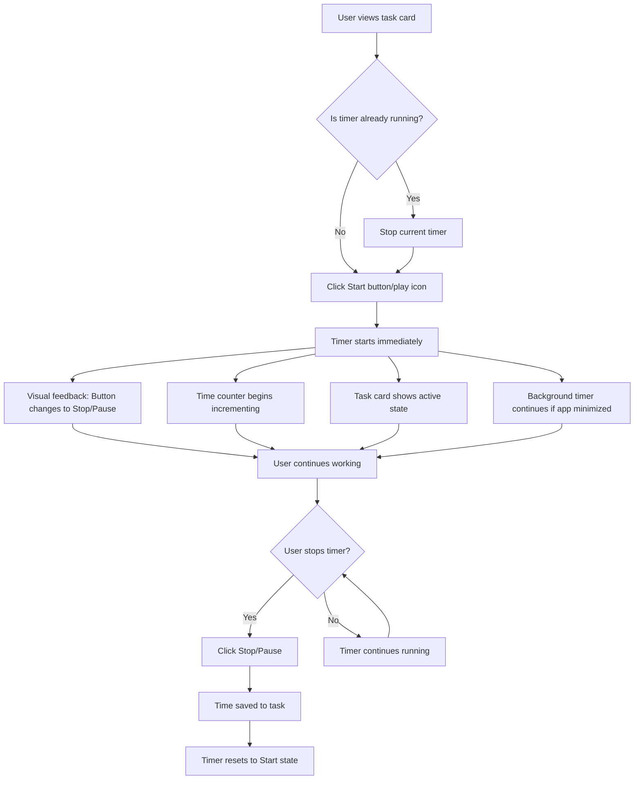
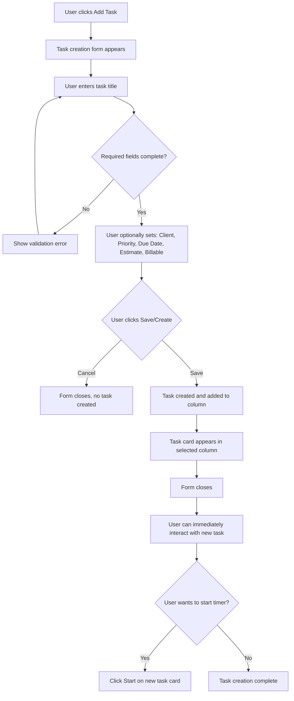
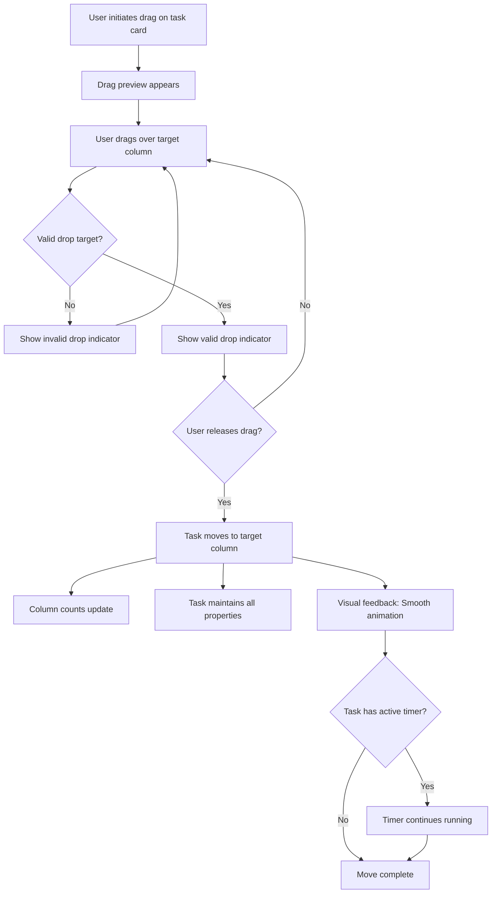
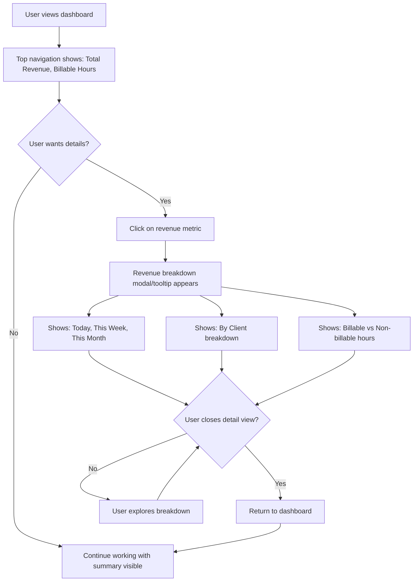

# User Flows

## Flow: Start Time Tracking on Task

**User Goal:** Begin tracking time for a specific task to capture billable hours accurately.

**Entry Points:**
- Click "Start" button on task card in any column
- Click play icon on task card
- Keyboard shortcut (TBD) while task card is focused

**Success Criteria:**
- Timer starts immediately with visual feedback
- Task card shows active timer indicator
- Time begins accumulating and displaying on card
- Only one timer can be active at a time (if another timer is running, it stops automatically)
- Top navigation shows active timer status (optional)

**Flow Diagram:**



**Edge Cases & Error Handling:**
- **Another timer is active:** Automatically stop the previous timer before starting the new one. Show brief notification: "Stopped timer on [Previous Task], started timer on [Current Task]"
- **Task deleted while timer running:** Stop timer automatically, save accumulated time, show notification
- **App closed/crashed while timer running:** On app restart, detect orphaned timer session and prompt user: "Timer was running on [Task] for [X] hours. Add this time?"
- **System time changes:** Use relative time tracking to prevent negative durations or time jumps
- **Multiple tasks selected:** Disable timer start if multiple tasks are selected (selection mode)
- **Task moved to Done column:** Optionally auto-stop timer with confirmation prompt

**Notes:** 
- Timer must persist across app restarts (background timer continues)
- Visual indicator should be prominent but not distracting
- Consider showing elapsed time in top navigation bar for always-visible feedback
- Timer precision: Track to the second, display rounded to nearest minute for readability

---

## Flow: Create New Task

**User Goal:** Quickly add a new task to the kanban board with essential information.

**Entry Points:**
- Click "+ Add task" button in top navigation
- Click "+" icon in column header
- Keyboard shortcut (Cmd/Ctrl + N or TBD)

**Success Criteria:**
- Task creation form appears quickly (modal or inline)
- Task is added to appropriate column
- User can immediately start timer or edit task details
- Form validates required fields (at minimum: task title)

**Flow Diagram:**



**Edge Cases & Error Handling:**
- **Empty task title:** Show inline validation error, prevent save until title entered
- **Duplicate task titles:** Allow duplicates but show warning: "Task with this name already exists"
- **Client not selected for billable task:** Show warning but allow creation (client can be added later)
- **Invalid time estimate format:** Validate format (e.g., "2h 30m" or "2.5h"), show format hint
- **Due date in past:** Allow but show warning: "Due date is in the past"
- **Form closed accidentally:** Auto-save draft to local storage, restore on next open
- **No columns exist:** Create default columns (Backlog, In Progress, Review, Done) automatically
- **Column deleted while form open:** Default to first available column or Backlog

**Notes:**
- Quick-add mode: Allow creating task with just title, add details later via task detail view
- Smart defaults: Pre-select current column, use last-used client if available
- Keyboard navigation: Tab through fields, Enter to save, Escape to cancel
- Inline editing option: Consider allowing direct typing in column (like Trello) for fastest creation

---

## Flow: Move Task Between Columns

**User Goal:** Update task status by moving it to a different workflow stage (e.g., Backlog → In Progress → Review).

**Entry Points:**
- Drag task card to target column
- Click task card menu → "Move to [Column]"
- Keyboard shortcut (arrow keys) while task card focused

**Success Criteria:**
- Task moves smoothly with visual feedback
- Task appears in target column immediately
- Original column updates task count
- Task state persists (timer, time spent, etc.)

**Flow Diagram:**



**Edge Cases & Error Handling:**
- **Drag cancelled (ESC key):** Return task to original position, no state change
- **Drag outside valid drop zone:** Show "Cannot drop here" indicator, return to original position on release
- **Column deleted during drag:** Cancel drag operation, show error: "Target column no longer exists"
- **Task deleted during drag:** Cancel drag operation gracefully
- **Multiple tasks selected:** Move all selected tasks together, show count in feedback
- **Keyboard navigation:** Arrow keys move task to adjacent column, show preview before confirming
- **Touch devices:** Support touch drag-and-drop for tablet users (desktop-first but responsive)

**Notes:**
- Animation duration: 200-300ms for smooth but quick feedback
- Visual feedback: Show drop zone highlight, ghost preview of task in target location
- Undo support: Consider "Undo move" toast notification for accidental moves
- Auto-actions: Optionally auto-stop timer when moving to "Done" column (with user preference setting)

---

## Flow: View Revenue Summary

**User Goal:** Understand current billable hours and revenue potential at a glance.

**Entry Points:**
- View top navigation metrics (always visible)
- Click on revenue metric in top navigation
- Navigate to Revenue Dashboard (future feature)

**Success Criteria:**
- Revenue information is immediately visible without navigation
- Metrics update in real-time as timers run and tasks are completed
- Breakdown available on demand (daily/weekly/monthly)

**Flow Diagram:**



**Edge Cases & Error Handling:**
- **No billable tasks:** Show "$0.00" with helpful message: "Mark tasks as billable to track revenue"
- **Tasks without hourly rates:** Show warning: "Some tasks missing hourly rates" with link to set rates
- **Negative time (manual adjustment):** Handle gracefully, show in breakdown with explanation
- **Currency formatting:** Support different currencies, decimal precision based on user settings
- **Large numbers:** Format appropriately (e.g., "$1.2K" for $1,200)

**Notes:**
- Top navigation metrics should be non-intrusive but always visible
- Consider color coding: Green for positive revenue, neutral for zero
- Real-time updates: Refresh metrics every minute or on task/timer changes
- Future: Full Revenue Dashboard with charts, trends, export capabilities

---

## Flow: Toggle Billable Status

**User Goal:** Mark a task as billable or non-billable to control revenue tracking.

**Entry Points:**
- Click billable indicator on task card
- Task detail view → Toggle billable checkbox
- Task menu → "Mark as billable/non-billable"

**Success Criteria:**
- Billable status toggles immediately
- Visual indicator updates on task card
- Revenue calculation updates in real-time
- Status persists across app sessions

**Flow Diagram:**

```mermaid
graph TD
    A[User views task card] --> B{Task currently billable?}
    B -->|Yes| C[Shows: Green $ indicator with amount]
    B -->|No| D[Shows: "Non-billable" badge or no indicator]
    C --> E{User clicks billable indicator}
    D --> E
    E --> F[Toggle billable status]
    F --> G{Now billable?}
    G -->|Yes| H[Show billable indicator with calculated revenue]
    G -->|No| I[Remove billable indicator, show "Non-billable"]
    H --> J[Update top navigation revenue total]
    I --> J
    J --> K{Task has hourly rate?}
    K -->|No| L[Show prompt: "Set hourly rate to calculate revenue"]
    K -->|Yes| M[Calculate and display revenue]
    L --> N[User can set rate or dismiss]
    M --> O[Status saved]
    N --> O
```

**Edge Cases & Error Handling:**
- **Task without hourly rate marked billable:** Show warning but allow, prompt to set rate
- **Client has default rate but task doesn't:** Use client rate automatically, show tooltip
- **Multiple tasks selected:** Toggle all selected tasks' billable status together
- **Task moved to non-billable:** Recalculate revenue totals, show impact in notification

**Notes:**
- Visual distinction: Billable tasks should be clearly distinguishable (green $ indicator in screenshot)
- Revenue calculation: Billable hours × hourly rate (task rate > client rate > default rate priority)
- Batch operations: Support selecting multiple tasks and toggling billable status for all
- Default behavior: New tasks inherit billable status from client/project settings if available
